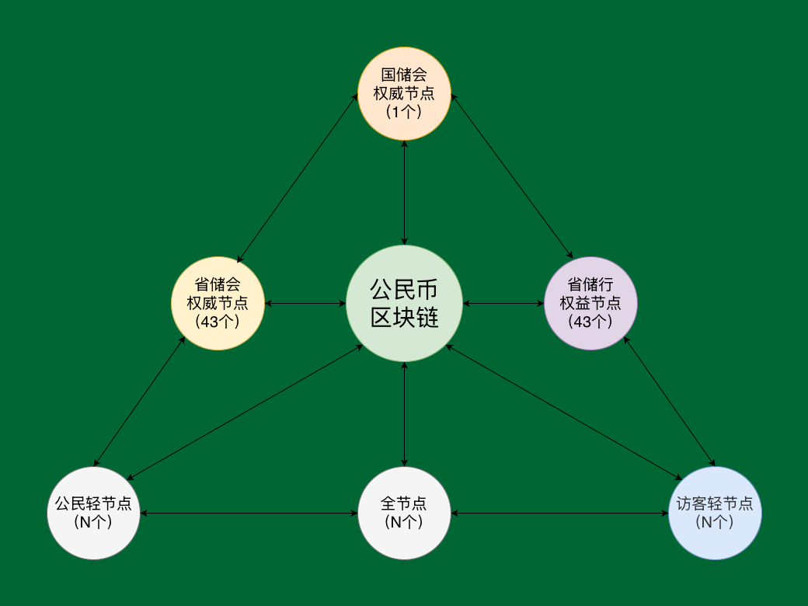
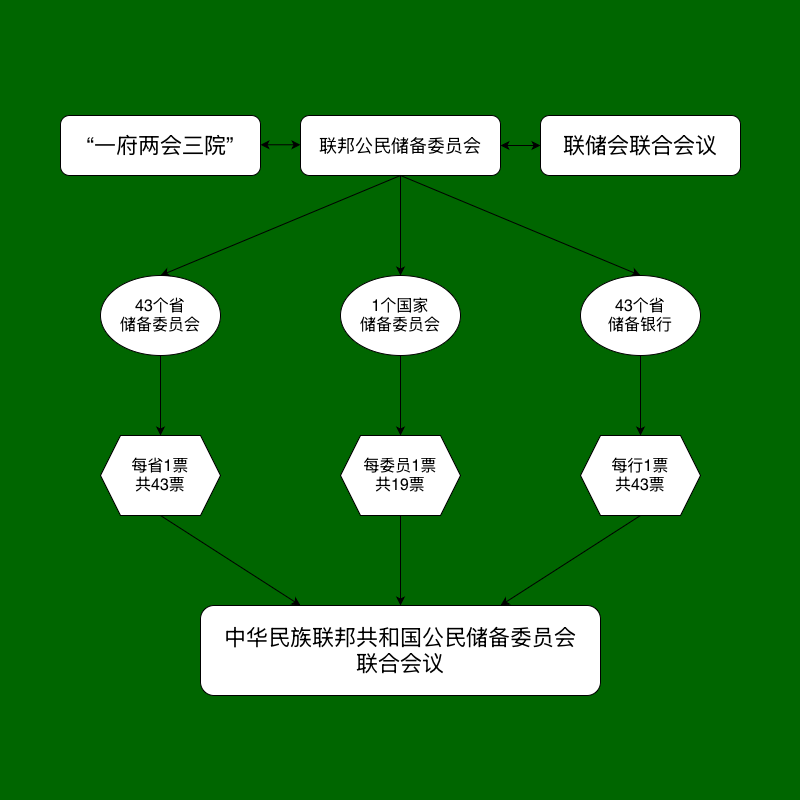

# **《公民链白皮书》**<br><span class="whitepaper-title-en">CitizenChain Whitepaper</span>

# 目录<br><span class="whitepaper-heading-en">Table of Contents</span>

- <details>
  <summary>1. 总则</summary>

  [1.1. 目的](#11目的)
  [1.2. 名称](#12名称)
  [1.3. 发行方](#13发行方)
  [1.4. 发行量](#14发行量)
  [1.5. 创世理念](#15创世理念)
  [1.6. 去中心化](#16去中心化)
  </details>

- <details>
  <summary>2. 节点设置</summary>

  [2.1. 节点概览](#21节点概览)
  [2.2. 国家储委会权威节点](#22国家储委会权威节点)
  [2.3. 省储委会权威节点](#23省储委会权威节点)
  [2.4. 省储行权益节点](#24省储行权益节点)
  [2.5. 全节点](#25全节点)
  [2.6. 轻节点：公民/访客](#26轻节点公民访客)
  </details>

- <details>
  <summary>3. 发行与销毁</summary>

  [3.1. 创世发行](#31创世发行)
  [3.2. 省储行创立发行与质押利息](#32省储行创立发行与质押利息)
  [3.3. 全节点发行](#33全节点发行)
  [3.4. 公民发行](#34公民发行)
  [3.5. 两和基金发行](#35两和基金发行)
  [3.6. 决议发行](#36决议发行)
  [3.7. 销毁](#37销毁)
  </details>

- <details>
  <summary>4. 技术架构</summary>

  [4.1. 主体架构](#41主体架构)
  [4.2. 运行时](#42运行时)
  [4.3. 节点](#43节点)
  [4.4. 链上中国](#44链上中国)
  </details>

- <details>
  <summary>5. 运行时</summary>

  [5.1. 创世模块](#51创世模块)
  [5.2. 投票引擎](#52投票引擎)
  [5.2.1. 内部投票](#521内部投票)
  [5.2.2. 联合投票](#522联合投票)
  [5.2.3. 立法投票](#523立法投票)
  [5.2.4. 选举投票](#524选举投票)
  [5.3. 治理模组](#53治理模组)
  [5.4. 管理员模组](#54管理员模组)
  [5.4.1. 个人多签管理员](#541个人多签管理员)
  [5.4.2. 私权机构管理员](#542私权机构管理员)
  [5.4.3. 公权机构管理员](#543公权机构管理员)
  [5.5. 公权业务模组](#55公权业务模组)
  [5.5.1. 立法院模块](#551立法院模块)
  [5.5.2. 具体公权选举业务模块](#552具体公权选举业务模块)
  [5.6. 实体模组](#56实体模组)
  [5.6.1. 个人多签](#561个人多签)
  [5.6.2. 私权机构](#562私权机构)
  [5.6.3. 公权机构](#563公权机构)
  [5.7. 发行模组](#57发行模组)
  [5.8. 交易模组](#58交易模组)
  [5.9. 其他模组](#59其他模组)
  </details>

- <details>
  <summary>6. 节点</summary>

  [6.1. 节点简介](#61节点简介)
  [6.2. 治理机构](#62治理机构)
  [6.3. 链下清算行](#63链下清算行)
  </details>

- <details>
  <summary>7. 链上中国</summary>

  [7.1. 链上中国简介](#71链上中国简介)
  [7.2. 注册局](#72注册局)
  [7.3. 链上立法](#73链上立法)
  [7.4. 链上选举](#74链上选举)
  </details>

- <details>
  <summary>8. 公民</summary>
  </details>

- <details>
  <summary>9. 公民钱包</summary>
  </details>

****
# 1.总则<br><span class="whitepaper-heading-en">1. General Principles</span>

## 1.1.目的<br><span class="whitepaper-heading-en">1.1. Purpose</span>

* 基于区块链技术以推动“公民建国运动”的主权区块链系统，创立公民链，采取去中心化民运，以建立自由民主的中华民族联邦共和国；<br><span class="whitepaper-en">CitizenChain is a sovereign blockchain system founded on blockchain technology to advance the Citizen Nation-Building Movement. It adopts a decentralized democratic movement model to establish a free and democratic Federal Republic of the Chinese Nation.</span>
* 公民链是一条不受任何机构掌控的主权区块链，一个所有人都能自由使用的法定数字货币系统，一条所有中华民族联邦共和国公民都能参与投票的区块链；<br><span class="whitepaper-en">CitizenChain is a sovereign blockchain not controlled by any institution, a legal digital-currency system freely usable by everyone, and a blockchain on which all citizens of the Federal Republic of the Chinese Nation may participate in voting.</span>
* 公民链依据《公民宪法》和《公民链白皮书》发行法定数字货币公民币，公民币是中华民族联邦共和国法定数字货币，是公民链治理货币；<br><span class="whitepaper-en">CitizenChain issues the legal digital currency Citizen Coin pursuant to the Citizen Constitution and the CitizenChain Whitepaper. Citizen Coin is the legal digital currency of the Federal Republic of the Chinese Nation and the governance currency of CitizenChain.</span>

## 1.2.名称<br><span class="whitepaper-heading-en">1.2. Name</span>

* 名称：公民链（英文：CitizenChain），原生数字货币：公民币，符号：GMB；<br><span class="whitepaper-en">Name: 公民链, English name: CitizenChain. Native digital currency: Citizen Coin. Symbol: GMB.</span>
* 单位：常用单位：元（YUAN），小数单位：分（FEN），元最小为1元，分最小为1分，100分等于1元，统一使用分为系统计算单位，使用元为前端展示单位。<br><span class="whitepaper-en">Units: the common unit is yuan (YUAN), and the fractional unit is fen (FEN). The minimum yuan unit is 1 yuan, the minimum fen unit is 1 fen, and 100 fen equals 1 yuan. The system uniformly uses fen as the calculation unit and yuan as the frontend display unit.</span>

* 本白皮书中的中文名称、英文名称和系统名称均以本节为统一约定，全文统一使用本节名称、缩写和系统称谓。<br><span class="whitepaper-en">The Chinese names, English names, and system names in this whitepaper are uniformly defined in this section. The entire whitepaper uses the names, abbreviations, and system terms defined here.</span>

```
|         中文术语        |                 英文/系统名称                  |                         说明                         |
|:----------------------:|:---------------------------------------------:|:---------------------------------------------------:|
| 公民主义                | Citizenism                                    | 国家根本政治理念，由民治、民主、民权、民生、民族构成 |
| 公民链                  | CitizenChain                                  | 主权区块链系统                                      |
| 公民币                  | Citizen Coin / GMB                            | 公民链原生法定数字货币和治理货币                    |
| 公民钱包                | CitizenWallet                                 | 离线冷钱包软件                                      |
| 公民                    | CitizenApp                                    | 公民链轻节点、热钱包、投票交互和去中心化通信软件      |
| 链上中国平台             | OnChina                                       | 公民链节点内置的本地治理与注册平台，负责管理员登录、公民档案、机构注册、法律文库、立法入口和链上身份提交 |
| 注册局                  | Registry                                      | 链上中国平台中的注册业务角色，包含联邦注册局和市注册局，用于注册公民、公权机构、私权机构和机构管理员 |
| 身份识别码               | CID / Identity Identification Code            | 注册局签发的统一身份号码，是公民身份、自然人和机构的身份编号字段 |
| 清算行                  | clearing bank                                 | 完成链上注册后提供链下支付清算服务的全节点            |
| 投票资格                | voting eligibility                            | 公民是否可参与投票的资格状态，由注册局根据公民护照状态判定 |
| 投票范围                | voting scope                                  | 公民按居住地参与投票的地域范围                       |
| 参选范围                | candidacy scope                               | 公民按出生地参与被选举或出生地类选举的地域范围        |
```

## 1.3.发行方<br><span class="whitepaper-heading-en">1.3. Issuer</span>

* 发行方为中华民族联邦共和国公民储备委员会联合会议；<br><span class="whitepaper-en">The issuer is the Joint Meeting of the Citizen Reserve Committee of the Federal Republic of the Chinese Nation.</span>
* 依据《公民宪法》储委会体系由1个国家储委会、43个省储委会和43个省储行组成。<br><span class="whitepaper-en">Pursuant to the Citizen Constitution, the Reserve Committee system consists of one National Reserve Committee, 43 Provincial Reserve Committees, and 43 Provincial Reserve Banks.</span>

## 1.4.发行量<br><span class="whitepaper-heading-en">1.4. Issuance Amount</span>

```
|     发行类型    |               发行金额/上限           |          释放/流通状态          |               执行模块/触发                |              账户归属/边界              |
|:--------------:|:-----------------------------------:|:----------------------------:|:----------------------------------------:|:--------------------------------------:|
|  创世发行       |  144,349,737,800.00元 (1443.49亿)    |   创世一次性流通               |  创世状态写入                             |  六个指定账户共700亿元、国家储委会19个创世管理员账户各1000万元，余额写入国家储委会主账户 |
|  省储行创立发行  |  144,349,737,800.00元 (1443.49亿)    |   永久质押                    |  创世状态写入+省储行常量                   |  43个省储行无私钥永久质押账户              |
|  省储行质押利息  |    72,896,617,589.00元 (728.97亿)    |   100年逐年释放               |  provincialbank-interest模块，每87,600块结算一次 |  43个省储行多签治理账户                   |
|  全节点发行     |    99,989,990,001.00元 (999.89亿)    |   第1至9,999,999块逐块释放      |  fullnode-issuance模块，出块时触发          |  出块矿工账户或其绑定奖励钱包              |
|  公民发行       | 1,571,981,633,622.00元 (1.57万亿)    |   首次链上投票身份登记后逐个释放   |  citizen-issuance模块，投票身份登记成功回调触发 |  完成投票身份登记的公民钱包账户，参选身份升级不重复发行 |
|  两和基金发行    |  195,818,501,966.00元 (1958.18亿)    |   创世一次性流通               |  创世状态HE_FUND_ISSUANCE写入              |  国家储委会两和基金账户                       |
|  已确定发行合计  | 2,229,386,218,778.00元 (2.23万亿)    |   按上述规则释放或质押           |  固定发行合计，不含决议发行                  |  不含后续治理决议新增发行                  |
|  决议发行       |  按单个提案金额执行，受链上限额约束       |   提案通过后一次性执行           |  resolution-issuance模块+联合投票回调       |  仅能发行至链上允许的合法收款账户集合        |
```

<span class="whitepaper-en">Issuance schedule:</span>

```
|       Issuance Type        |              Amount / Cap             |              Release / Circulation Status              |                 Execution Module / Trigger                |                 Account Ownership / Boundary                |
|:--------------------------:|:------------------------------------:|:------------------------------------------------------:|:--------------------------------------------------------:|:----------------------------------------------------------:|
| Genesis issuance           | 144,349,737,800.00 yuan (144.349 billion) | One-time circulation at genesis | Written into genesis state | Six designated accounts total 70.0 billion yuan; the 19 NRC genesis administrator accounts 10,000,000 yuan each; the balance to the NRC main account |
| Provincial reserve bank founding issuance | 144,349,737,800.00 yuan (144.349 billion) | Permanently staked | Genesis state plus provincial reserve bank constants | 43 provincial reserve bank staking accounts without private keys |
| Provincial reserve bank staking interest | 72,896,617,589.00 yuan (72.897 billion) | Released annually over 100 years | provincialbank-interest module, once every 87,600 blocks | 43 provincial reserve bank multisig governance accounts |
| Full-node issuance         | 99,989,990,001.00 yuan (99.990 billion) | Released block by block from block 1 through block 9,999,999 | fullnode-issuance module, triggered by block production | Block author account or its bound reward wallet |
| Citizen light-node issuance | 1,571,981,633,622.00 yuan (1.572 trillion) | Released one by one after first on-chain voting-identity registration | citizen-issuance module, triggered by successful voting-identity registration callback | Citizen wallet accounts with completed voting-identity registration; candidate-identity upgrade does not issue again |
| Reconciliation Fund issuance | 195,818,501,966.00 yuan (195.818 billion) | One-time circulation at genesis | HE_FUND_ISSUANCE written into genesis state | National Reserve Committee Reconciliation Fund account |
| Determined issuance total | 2,229,386,218,778.00 yuan (2.229 trillion) | Released or staked under the rules above | Fixed issuance total, excluding resolution issuance | Excludes later issuance added by governance resolution |
| Resolution issuance        | Executed by proposal amount and constrained by on-chain limits | One-time execution after proposal approval | resolution-issuance module plus joint-vote callback | May issue only to the on-chain allowed recipient set |
```

* 上述发行金额以元为展示单位，链上以分为计算单位；固定发行合计为2,229,386,218,778.00元，不包含后续决议发行。<br><span class="whitepaper-en">The amounts above are displayed in yuan while on-chain calculation uses fen. The fixed determined issuance total is 2,229,386,218,778.00 yuan, excluding later resolution issuance.</span>
* 决议发行不是创世固定发行的一部分，只能在储委会联合会议决议、链上联合投票和发行模块限额校验均通过后执行；交易手续费不属于发行，销毁会减少链上总供应量。<br><span class="whitepaper-en">Resolution issuance is not part of fixed genesis issuance. It may execute only after resolution of the Reserve Committee Joint Meeting, on-chain joint voting, and issuance-module limit checks all pass. Transaction fees are not issuance, and destruction reduces total on-chain supply.</span>

## 1.5.创世理念<br><span class="whitepaper-heading-en">1.5. Genesis Philosophy</span>

* 公民宣言：先有人类后有国家，是公民建立国家，国家是公民的国家，是公民治理国家，而不是国家统治公民，公民没有爱国的义务；国家政权的建立其基本原则是保护公民的生命权、自由权、财产权、反抗压迫权和选举与被选举权不受任何的非法侵犯，当国家政权无法保证这一基本原则时，公民有权有义务推翻这个政权，建立一个以保障公民生命权、自由权、财产权、反抗压迫权和选举与被选举权为基本原则的政权。<br><span class="whitepaper-en">Citizen Declaration: humanity precedes the state. Citizens establish the state; the state belongs to citizens; citizens govern the state; the state does not rule over citizens; and citizens have no obligation of patriotism. The founding principle of state power is to protect citizens' rights to life, liberty, property, resistance against oppression, and to vote and stand for election from any unlawful infringement. When state power cannot guarantee this basic principle, citizens have both the right and the duty to overthrow that regime and establish a regime whose founding principle is the protection of citizens' rights to life, liberty, property, resistance against oppression, and to vote and stand for election.</span>
* 国家名称与公民主义：中华民族联邦共和国国家名称是基于中华各民族悠久历史与璀璨文化的沉淀，全称为：中华民族联邦共和国，简称为：中华联邦；中华民族联邦共和国是致力于推行“公民主义”的———「公民治理国家（民治）、实行民主共和（民主）、保障公民权利（民权）、建设民生社会（民生）、复兴民族文化（民族）」———联邦制共和国。<br><span class="whitepaper-en">State name and Citizenism: the state name Federal Republic of the Chinese Nation is rooted in the long history and splendid cultures of the various ethnic groups of the Chinese Nation. Its full name is the Federal Republic of the Chinese Nation, and its abbreviated name is the Chinese Federation. The Federal Republic of the Chinese Nation is a federal republic committed to advancing “Citizenism”: the governance of the State by citizens (mínzhì), the practice of democratic republicanism (mínzhǔ), the protection of citizens’ rights (mínquán), the building of a society of citizens’ livelihood (mínshēng), and the revival of ethnic cultures (mínzú).</span>

## 1.6.去中心化<br><span class="whitepaper-heading-en">1.6. Decentralization</span>

* 公民链及其附属软件采用MIT开源协议，并在GitHub上开放源代码，以构建一套使开发者能快速、简易开发部署区块链应用的系统；<br><span class="whitepaper-en">CitizenChain and its affiliated software use the MIT open-source license and publish their source code on GitHub, with the goal of building a system that enables developers to develop and deploy blockchain applications quickly and easily.</span>
* 公民链坚持去中心化，任何个人、任何组织都可以加入成为去中心化的节点（全节点、轻节点），及参与公民链的治理与技术开发。<br><span class="whitepaper-en">CitizenChain upholds decentralization. Any individual or organization may join as a decentralized node, including a full node or light node, and may participate in CitizenChain governance and technical development.</span>

****
# 2.节点设置<br><span class="whitepaper-heading-en">2. Node Configuration</span>

## 2.1.节点概览<br><span class="whitepaper-heading-en">2.1. Node Overview</span>

```
|  节点  |  国家储委会权威节点  |   初始省储委会权威节点  |  初始省储行权益节点  |     全节点     |          轻节点       |
|:-----:|:--------------:|:------------------:|:-----------------:|:-------------:|:--------------------:|
|  数量  |       1个      |        43个        |        43个        |      无限     |      公民/访客：无限    |
|  功能  | 国家级治理与最终性 |  省级治理与最终性投票   | 永久质押与省储行治理  | PoW出块、链数据保存、本地服务、可选链上中国和清算行能力 | 钱包、公民身份确认、投票、通信 |
```

<span class="whitepaper-en">Node overview:</span>

```
| Node | National Reserve Committee Authority Node | Initial Provincial Reserve Committee Authority Nodes | Initial Provincial Reserve Bank Stake Nodes | Full Nodes | Light Nodes |
|:----:|:-----------------------------------------:|:----------------------------------------------------:|:------------------------------------------:|:----------:|:-----------:|
| Quantity | 1 | 43 | 43 | Unlimited | Citizens / visitors: unlimited |
| Function | National governance and finality | Provincial governance and finality voting | Permanent staking and provincial reserve bank governance | PoW block production, chain-data storage, local services, optional OnChina and clearing-bank capabilities | Wallet, citizen identity, voting, communication |
```



## 2.2.国家储委会权威节点<br><span class="whitepaper-heading-en">2.2. National Reserve Committee Authority Node</span>

* 有1个国家储委会权威节点，不能增删改，拥有19个管理员，分别对应国家储委会的19个委员；<br><span class="whitepaper-en">There is one National Reserve Committee authority node. It cannot be added, deleted, or modified. It has 19 administrators, corresponding respectively to the 19 members of the National Reserve Committee.</span>
* 国家储委会拥有19票投票权和4个多签名治理账户（主账户+费用账户+安全基金账户+两和基金账户），采用N=19，T≥13签名，通过则19票同时生效，反之则同时否决；<br><span class="whitepaper-en">The National Reserve Committee has 19 votes and four multisignature governance accounts: a main account, a fee account, a security fund account, and a Reconciliation Fund account. It uses N=19 and threshold T>=13 signatures. If approved, all 19 votes take effect simultaneously; otherwise, they are all rejected simultaneously.</span>
* 国家储委会拥有发起“发行数字公民币、销毁数字公民币、协议升级、更换国家储委会多签管理员、增删改新省储委会/新省储行”等提案权，承担数据归档和节点引导；<br><span class="whitepaper-en">The National Reserve Committee has the authority to initiate proposals including issuing digital Citizen Coins, destroying digital Citizen Coins, protocol upgrades, replacing National Reserve Committee multisig administrators, and adding, deleting, or modifying new Provincial Reserve Committees or Provincial Reserve Banks. It also undertakes data archiving and node bootstrapping.</span>
* 国家储委会和省储委会负责区块的最终性确认，由一套最终性验证密钥负责投票，此投票仅属于区块的最终性确认投票，投票由国家储委会1票+43个省储委会每省1票=44票，大于等于30票即生成确定性最终性；<br><span class="whitepaper-en">The National Reserve Committee and Provincial Reserve Committees are responsible for block finality confirmation. A set of finality validation keys is responsible for voting, and this vote is only for block finality confirmation. The vote consists of one National Reserve Committee vote plus one vote from each of the 43 Provincial Reserve Committees, for a total of 44 votes. At least 30 votes generate deterministic finality.</span>
* 国家储委会费用账户用于接收10%的链上交易手续费，且只能往主账户转账；安全基金账户用于接收10%的链上交易手续费，安全基金用于赔付用户因区块链技术原因造成的损失。<br><span class="whitepaper-en">The National Reserve Committee fee account receives 10% of on-chain transaction fees and may only transfer funds to the main account. The security fund account receives 10% of on-chain transaction fees, and the security fund is used to compensate users for losses caused by blockchain technology reasons.</span>

## 2.3.省储委会权威节点<br><span class="whitepaper-heading-en">2.3. Provincial Reserve Committee Authority Nodes</span>

* 初始43个省，每省1个省储委会权威节点，初始权威节点不能增删改，每个节点拥有9个管理员，分别对应省储委会的9个委员；<br><span class="whitepaper-en">There are initially 43 provinces, each with one Provincial Reserve Committee authority node. These initial authority nodes cannot be added, deleted, or modified. Each node has nine administrators, corresponding respectively to the nine members of the Provincial Reserve Committee.</span>
* 每个省储委会拥有1票投票权和2个多签名治理账户（主账户+费用账户），采用N=9，T≥6签名，签名通过则生效，反之则否决；<br><span class="whitepaper-en">Each Provincial Reserve Committee has one vote and two multisignature governance accounts: a main account and a fee account. It uses N=9 and threshold T>=6 signatures. If the signatures pass, the decision takes effect; otherwise, it is rejected.</span>
* 省储委会拥有发起“销毁数字公民币、更换省储委会多签管理员、提案发行”等提案权，承担数据归档、节点引导和区块最终性投票。<br><span class="whitepaper-en">A Provincial Reserve Committee has the authority to initiate proposals including destroying digital Citizen Coins, replacing Provincial Reserve Committee multisig administrators, and proposing issuance. It undertakes data archiving, node bootstrapping, and block finality voting.</span>

## 2.4.省储行权益节点<br><span class="whitepaper-heading-en">2.4. Provincial Reserve Bank Stake Nodes</span>

* 初始43个省，每省1个省储行权益节点，初始权益节点不能增删改，每个节点拥有9个管理员，分别对应省储行的9个董事会成员；<br><span class="whitepaper-en">There are initially 43 provinces, each with one Provincial Reserve Bank stake node. These initial stake nodes cannot be added, deleted, or modified. Each node has nine administrators, corresponding respectively to the nine board members of the Provincial Reserve Bank.</span>
* 每个省储行拥有1票投票权和2个多签名治理账户（主账户+费用账户），采用N=9，T≥6签名，签名通过则生效，反之则否决；<br><span class="whitepaper-en">Each Provincial Reserve Bank has one vote and two multisignature governance accounts: a main account and a fee account. It uses N=9 and threshold T>=6 signatures. If the signatures pass, the decision takes effect; otherwise, it is rejected.</span>
* 省储行费用账户是省储行自身的机构费用账户；链下清算由完成链上注册的清算行全节点承担；<br><span class="whitepaper-en">The Provincial Reserve Bank fee account is the Provincial Reserve Bank's own institutional fee account. Off-chain clearing is undertaken by full nodes that complete on-chain clearing-bank registration.</span>
* 每个省储行拥有1个永久质押账户，永久质押账户只能接收数字公民币，用于永久质押省储行创立发行的数字公民币；<br><span class="whitepaper-en">Each Provincial Reserve Bank has one permanent staking account. The staking account may only receive digital Citizen Coins and is used to permanently stake the digital Citizen Coins issued at the founding of the Provincial Reserve Bank.</span>
* 省储行拥有发起“销毁数字公民币、更换省储行多签管理员”等内部治理提案权，并在联合投票中拥有省储行票权，承担数据归档和节点引导。<br><span class="whitepaper-en">A Provincial Reserve Bank has the authority to initiate internal-governance proposals including destroying digital Citizen Coins and replacing Provincial Reserve Bank multisig administrators. It also holds Provincial Reserve Bank voting power in joint votes and undertakes data archiving and node bootstrapping.</span>

## 2.5.全节点<br><span class="whitepaper-heading-en">2.5. Full Nodes</span>

* 全节点是链同步、交易验证和新块铸块节点，按归档或普通模式保存链数据；链上中国平台和节能能力是可按需打开或关闭的本地节点能力；新区块特指除创世区块以外的所有区块，采用PoW共识机制获得铸块权；<br><span class="whitepaper-en">Full nodes are chain-synchronization, transaction-validation, and new-block minting nodes. They store chain data in archive or regular mode; the OnChina platform and energy-saving capability are local node capabilities that can be enabled or disabled as needed. New blocks refer to all blocks other than the genesis block. Full nodes obtain block-minting rights through the PoW consensus mechanism.</span>
* 全节点数量不限，部署运行citizenchain（中文：公民链）的即全节点，任何组织、任何人均可下载安装节点软件成为全节点，全节点只分为归档全节点和普通全节点两种模式，默认启动为归档全节点模式；<br><span class="whitepaper-en">The number of full nodes is unlimited. Any deployment that runs citizenchain (Chinese: 公民链) is a full node. Any organization or individual may download and install the node software to become a full node. Full nodes have only two modes: archive full node and regular full node. The default startup mode is archive full node.</span>
* 清算行不是新的机构类型，而是全节点的链下清算角色；全节点在注册局注册为私法人股份公司或其下属非法人，并在链上完成清算行节点声明后，可加入清算网络成为清算行节点；<br><span class="whitepaper-en">A clearing bank is not a new institution type; it is an off-chain clearing role of a full node. A full node registered with the Registry as a private legal-person joint-stock company or its subordinate unincorporated entity may join the clearing network as a clearing-bank node after completing on-chain clearing-bank node declaration.</span>
* 清算行节点必须绑定机构主账户、节点 PeerId 和可访问的 RPC 端点；用户可绑定清算行开户，清算行可提供扫码支付清算服务，并获得其作为收款方清算行实际执行的链下清算手续费；<br><span class="whitepaper-en">A clearing-bank node must bind its institutional main account, node PeerId, and reachable RPC endpoint. Users may bind a clearing bank to open a clearing account. The clearing bank may provide QR-payment clearing services and receives the off-chain clearing fees for settlement it actually performs as the recipient-side clearing bank.</span>
* 清算网络是连接去中心化金融与传统金融的纽带，把符合资格并有能力部署全节点的银行、第三方支付机构和企业纳入公民链，为用户提供快速的去中心化金融服务。<br><span class="whitepaper-en">The clearing network links decentralized finance with traditional finance. It brings eligible banks, third-party payment providers, and enterprises capable of deploying full nodes into CitizenChain, providing users with fast decentralized financial services.</span>
* 权威节点、权益节点和清算行节点必须是归档全节点，其他任意节点可自行选择归档全节点或普通全节点；归档全节点保存完整区块链数据，适合治理机构、清算行和需要完整历史数据的组织；普通全节点适用于大部分用户，使用剪裁后的链数据，同时保留挖矿和出块能力，以节约磁盘空间。链上中国平台和节能能力属于本机节点能力，可在节点桌面端按需打开或关闭。<br><span class="whitepaper-en">Authority nodes, stake nodes, and clearing-bank nodes must be archive full nodes. Any other node may choose archive full node or regular full node. Archive full nodes store complete blockchain data and are suitable for governance institutions, clearing banks, and organizations that need complete historical data. Regular full nodes are suitable for most users: they use pruned chain data while retaining mining and block-production capability, thereby saving disk space. The OnChina platform and energy-saving capability are local node capabilities that can be enabled or disabled from the desktop console as needed.</span>

## 2.6.轻节点：公民/访客<br><span class="whitepaper-heading-en">2.6. Light Nodes: Citizens / Visitors</span>

* 使用 CitizenApp（公民）节点软件并完成链上投票身份登记的即公民轻节点，公民身份识别码与投票钱包账户一对一登记，登记完成后可获得投票权，一个身份识别码只能同时对应一个投票钱包账户。<br><span class="whitepaper-en">A light node using the CitizenApp citizen node software and completing on-chain voting-identity registration is a citizen light node. The citizen identity identification code and voting wallet account are registered one-to-one. After registration is completed, the node obtains voting rights. One identity identification code may correspond to only one voting wallet account at a time.</span>
* 安装CitizenApp节点软件未绑定的,为访客轻节点，访客轻节点没有投票权，使用第三方钱包的，亦为访客轻节点。<br><span class="whitepaper-en">A CitizenApp node installation that is not bound is a visitor light node. Visitor light nodes have no voting rights. Users of third-party wallets are also visitor light nodes.</span>

****
# 3.发行与销毁<br><span class="whitepaper-heading-en">3. Issuance and Destruction</span>

## 3.1.创世发行<br><span class="whitepaper-heading-en">3.1. Genesis Issuance</span>

* 创世发行144,349,737,800.00元数字公民币（1443.49亿元），以中共第7次人口普查数为准，每个中共国人发行100.00元数字公民币。创世状态一次性按账户预置：六个指定账户共700.00亿元（联邦公民安全基金100.00亿元、公民个人钱包200.00亿元、公民链技术发展基金会主账户100.00亿元、联邦注册局主账户100.00亿元、国家司法院主账户100.00亿元、国家储委会安全基金100.00亿元）；国家储委会19个创世管理员账户各1000.00万元；余额74,159,737,800.00元写入国家储委会主账户。创世发行总量保持不变。<br><span class="whitepaper-en">Genesis issuance is 144,349,737,800.00 yuan of digital Citizen Coins (144.349 billion yuan), based on the CCP's Seventh National Population Census, issuing 100.00 yuan per person under CCP rule. In genesis state it is preset once by account: six designated accounts totaling 70.0 billion yuan (Federal Citizen Security Fund 10.0 billion, a citizen's personal wallet 20.0 billion, CitizenChain Technology Development Foundation main account 10.0 billion, Federal Registry Bureau main account 10.0 billion, National Judicial Yuan main account 10.0 billion, National Reserve Committee security-fund account 10.0 billion); the 19 NRC genesis administrator accounts at 10,000,000.00 yuan each; and the remaining 74,159,737,800.00 yuan to the NRC main account. The total genesis issuance remains unchanged.</span>

```
中共第7次人口普查总人口数：1,443,497,378人   ｜    公民币创世发行量：144,349,737,800.00元
```

<span class="whitepaper-en">CCP's Seventh National Population Census total population: 1,443,497,378 people | Citizen Coin genesis issuance: 144,349,737,800.00 yuan</span>

* 国家储委会在公民链上的创世身份识别码为 `LN001-NRC0G-944805165-2026`，链端固定国家储委会主账户、费用账户、安全基金账户和两和基金账户；其中，创世发行余额写入主账户，两和基金发行写入两和基金账户，费用账户和安全基金账户用于后续链上交易费分账。<br><span class="whitepaper-en">The National Reserve Committee genesis identity identification code on CitizenChain is `LN001-NRC0G-944805165-2026`. The chain fixes the NRC main account, fee account, safety-fund account, and Reconciliation Fund account. The genesis-issuance balance is written to the main account, Reconciliation Fund issuance is written to the Reconciliation Fund account, and the fee account and safety-fund account are used for later on-chain transaction-fee distribution.</span>

```
国家储委会主账户：w5FeELKL18kHBGrhFpt6F91xuW1GWpr79CQ4fWgwMEzZtm1jU
国家储委会费用账户：w5EPSwHc7WfFv4VhiRWochDVCZgftf8Jx5iZmEBhcbwrBZMfU
安全基金账户：w5GTQvsevT7RNNnr963UDX4Kbm2bBEmjsjSaczhRBJX41UWvM
两和基金账户：w5DGrDtSJvnxgztNZ8HuYprX4cNFcPCYA6RuTEzVys2Q1bjgi
```

* 一个人在社会中享有若干权益的同时，同样应尽若干义务，尽了若干义务的，亦应享受若干权益；创世发行寓意每一个中共国人支付100.00元公民币，以支持“公民建国运动”，使全体中共国人共同建立中华民族联邦共和国。<br><span class="whitepaper-en">While a person enjoys certain rights and interests in society, that person should likewise fulfill certain obligations; and after fulfilling certain obligations, that person should likewise enjoy certain rights and interests. Genesis issuance symbolizes each person under CCP rule paying 100.00 Citizen Coins to support the Citizen Nation-Building Movement, so that all people under CCP rule jointly establish the Federal Republic of the Chinese Nation.</span>
* 创世发行只在创世状态中写入一次，链进入运行期后不得再次触发创世发行；上述各账户的创世预置余额均属于创世状态分配，不是后续可重复调用的发行入口。<br><span class="whitepaper-en">Genesis issuance is written exactly once in genesis state. After the chain enters the operating period, genesis issuance cannot be triggered again. The preset balances of all the above accounts are part of genesis-state allocation and are not later repeatable issuance entries.</span>
## 3.2.省储行创立发行与质押利息<br><span class="whitepaper-heading-en">3.2. Provincial Reserve Bank Founding Issuance and Staking Interest</span>

* 初始省储行节点，每个省储行发行该省总人口数x100的数字公民币，各省人口以中共第7次人口普查数为准（并做省份调整），共计发行144,349,737,800元；<br><span class="whitepaper-en">For the initial Provincial Reserve Bank nodes, each Provincial Reserve Bank issues digital Citizen Coins equal to that province's total population multiplied by 100. Provincial populations are based on the CCP's Seventh National Population Census, with provincial adjustments, for a total issuance of 144,349,737,800 yuan.</span>
* 各省储行创立发行的数字公民币永久质押于该省储行质押地址，该地址为无私钥地址，永久质押；<br><span class="whitepaper-en">The digital Citizen Coins issued at the founding of each Provincial Reserve Bank are permanently staked at that Provincial Reserve Bank's staking address. This address has no private key and is permanently staked.</span>
* 各省储行质押的数字公民币，由区块链支付100年质押利息,质押利息存入各省储行多签名治理账户，利息归各省储行所有，用于省储行运营和资助公民运动人士；<br><span class="whitepaper-en">For the digital Citizen Coins staked by each Provincial Reserve Bank, the blockchain pays staking interest for 100 years. The staking interest is deposited into each Provincial Reserve Bank multisignature governance account, belongs to that Provincial Reserve Bank, and is used for Provincial Reserve Bank operations and to support citizen-movement activists.</span>
* 质押利息初始年利率为1%，并以线性衰减的方式每年减少0.01%，100年后停止计算利息，共产生利息72,896,617,589.00元公民币；<br><span class="whitepaper-en">The initial annual staking-interest rate is 1%, decreasing linearly by 0.01% each year. Interest calculation stops after 100 years, producing total interest of 72,896,617,589.00 Citizen Coins.</span>
* 省储行质押利息由 provincialbank-interest 模块按年度边界结算，每年为87,600个区块；收款方固定为43个省储行多签治理账户，不能由外部调用临时替换；<br><span class="whitepaper-en">Provincial reserve bank staking interest is settled by the provincialbank-interest module at annual boundaries, with one year equal to 87,600 blocks. Recipients are fixed as the 43 provincial reserve bank multisig governance accounts and cannot be temporarily replaced by an external call.</span>
* 年度利息按顺序结算，前一年度未完成时不得跳过后续年度；当年度43个省储行均结算成功后，该年度才视为完成，低于 ED 的粉尘利息不铸造。<br><span class="whitepaper-en">Annual interest is settled sequentially. Later years cannot be skipped while an earlier year remains unsettled. A year is considered complete only after all 43 provincial reserve banks settle successfully, and dust interest below ED is not minted.</span>
* 各省储行创立发行与质押利息详见：citizenchain/runtime/primitives/cid/china/china_ch.rs<br><span class="whitepaper-en">For details of each Provincial Reserve Bank founding issuance and staking interest, see citizenchain/runtime/primitives/cid/china/china_ch.rs.</span>

## 3.3.全节点发行<br><span class="whitepaper-heading-en">3.3. Full-Node Issuance</span>

* 运行全节点的每铸造一个新区块，系统发行9999.00元数字公民币用于奖励该节点，全节点铸块发行为第1个至第9,999,999个区块，共计发行量为99,989,990,001.00元数字公民币；<br><span class="whitepaper-en">Each time a running full node mints a new block, the system issues 9,999.00 yuan of digital Citizen Coins to reward that node. Full-node block-minting issuance applies from block 1 through block 9,999,999, with a total issuance of 99,989,990,001.00 digital Citizen Coins.</span>
* 当区块高度超过9,999,999个区块后（第10,000,000个起，含本数），即永久停止全节点发行，此后全节点铸造新块不获得铸块奖励（运行全节点享受链上交易手续费80%的分成）。<br><span class="whitepaper-en">When block height exceeds 9,999,999 blocks, starting from block 10,000,000 inclusive, full-node issuance permanently stops. Full nodes that mint new blocks thereafter receive no block rewards, though running full nodes receive an 80% share of on-chain transaction fees.</span>
* 全节点发行只负责按出块事实发放奖励，不参与 PoW 出块权计算；奖励在区块完成时根据区块作者写入矿工账户，矿工绑定奖励钱包后写入其绑定钱包。<br><span class="whitepaper-en">Full-node issuance only pays rewards according to actual block production and does not participate in PoW block-author selection. Rewards are written to the miner account when the block completes, or to the miner's bound reward wallet after such binding exists.</span>

```
|  单个区块发行量 |   可发行的区块总量   |        总发行量          |     简述     |
|:-------------:|:-----------------:|:-----------------------:|:-----------:|
|   9999.00元   |     9,999,999个    |  99,989,990,001.00元   |  999.89亿元   |
```

<span class="whitepaper-en">Full-node issuance table:</span>

```
| Issuance Per Block | Total Issuable Blocks | Total Issuance | Summary |
|:------------------:|:---------------------:|:--------------:|:-------:|
| 9,999.00 yuan | 9,999,999 blocks | 99,989,990,001.00 yuan | 99.989 billion yuan |
```

## 3.4.公民发行<br><span class="whitepaper-heading-en">3.4. Citizen Issuance</span>

* 完成首次链上投票身份登记的公民，将获得认证奖励，可获得认证奖励的公民总量为1,443,497,378个，前14,436,417个完成投票身份登记的公民，每人奖励9999.00元；第14,436,417个之后完成投票身份登记的公民，每人奖励999.00元；参选身份是在投票身份基础上的升级，不重复触发公民发行。<br><span class="whitepaper-en">A citizen who completes first on-chain voting-identity registration receives a certification reward. The total number of citizens eligible for certification rewards is 1,443,497,378. Each of the first 14,436,417 citizens completing voting-identity registration receives a reward of 9,999.00 yuan; each citizen registered after the 14,436,417th receives a reward of 999.00 yuan. Candidate identity is an upgrade on top of voting identity and does not trigger citizen issuance again.</span>
* 达到公民发行总量后，后续认证的节点无奖励，认证发行奖励以先完成认证优先获得，每个身份识别码仅能获得一次认证奖励，公民发行能让更多的公民参与“公民建国运动”。<br><span class="whitepaper-en">After the citizen issuance cap is reached, later certified nodes receive no rewards. Certification issuance rewards are obtained in priority order by those who complete certification first. Each identity identification code may receive the certification reward only once. Citizen issuance enables more citizens to participate in the Citizen Nation-Building Movement.</span>
* 公民发行不提供人工补发入口，也不由用户直接调用发行接口；只有链上投票身份登记成功后，公民身份回调才能触发 citizen-issuance 模块执行奖励，参选身份升级只补充参选所需字段。<br><span class="whitepaper-en">Citizen issuance provides no manual reissue entry point and is not directly invoked by users. Only after successful on-chain voting-identity registration may the citizen-identity callback trigger the citizen-issuance module to execute the reward; candidate-identity upgrade only adds fields required for candidacy.</span>
* 同一身份识别码、同一账户均只能获得一次公民发行奖励；达到节点总量上限或重复绑定时，模块只记录跳过结果，不新增发行。<br><span class="whitepaper-en">The same identity identification code and the same account may each receive the citizen issuance reward only once. When the node cap is reached or a repeated binding occurs, the module only records the skipped result and does not create new issuance.</span>

```
|   阶段    |     认证节点数     |   单节点发行金额   |         总发行量          |      简述       |
|:--------:|:-----------------:|:---------------:|:------------------------:|:--------------:|
|  未超过   |     14,436,417个  |    9,999.00元    |    144,349,733,583.00元  |   1443.49亿元   |
|  超过后   |  1,429,060,961个  |      999.00元    |  1,427,631,900,039.00元  |  14276.31亿元   |
|  总 计    |  1,443,497,378个  |        -        |  1,571,981,633,622.00元  |  15719.81亿元   |
```

<span class="whitepaper-en">Citizen issuance table:</span>

```
| Stage | Certified Nodes | Issuance Per Node | Total Issuance | Summary |
|:-----:|:---------------:|:-----------------:|:--------------:|:-------:|
| Up to the threshold | 14,436,417 | 9,999.00 yuan | 144,349,733,583.00 yuan | 144.349 billion yuan |
| After the threshold | 1,429,060,961 | 999.00 yuan | 1,427,631,900,039.00 yuan | 1.427631 trillion yuan |
| Total | 1,443,497,378 | - | 1,571,981,633,622.00 yuan | 1.571981 trillion yuan |
```

## 3.5.两和基金发行<br><span class="whitepaper-heading-en">3.5. Reconciliation Fund Issuance</span>

* 两和基金发行是指历史和解与和平建国基金发行，发行目的是为了历史和解与和平建立民主自由的中华民族联邦共和国；中华民族的历史包袱太重，几千年的同室操戈、相互攻伐致使历史血债累累，但是，如果我们不从历史中汲取教训，继续争斗，即使再过数千年，这片土地上也不会长出自由、博爱的花朵；所以，需要从我们这一代人开始，与历史和解，把所有的仇恨化为明鉴，放下仇恨，以和平的方式建立一个自由、民主、博爱的国家；<br><span class="whitepaper-en">Reconciliation Fund issuance refers to the issuance of the Historical Reconciliation and Peaceful Nation-Building Fund. Its purpose is to achieve historical reconciliation and peace and to build a democratic and free Federal Republic of the Chinese Nation. The China nation carries too heavy a historical burden: thousands of years of internecine strife and mutual slaughter have left a long trail of blood debts. Yet if we do not learn from history and keep fighting, then even after thousands more years no flowers of freedom and fraternity will grow on this land. Therefore, beginning with our generation, we must reconcile with history, turn all hatred into a clear mirror, lay down our hatred, and build a free, democratic, and fraternal nation by peaceful means.</span>
* 两和基金发行额为195,818,501,966.00元（1958.18亿元），其中，1958代表大跃进、1850代表太平天国战争、1966代表文革运动，整组数据分别表达中华大地上死亡人数最多的政治运动、死亡人数最多的战争和人文倒退最严重的文化大革命运动，以此警醒世人勿重蹈覆辙；<br><span class="whitepaper-en">The Reconciliation Fund issuance amount is 195,818,501,966.00 yuan (195.818 billion yuan). In this figure, 1958 stands for the Great Leap Forward, 1850 for the Taiping Rebellion war, and 1966 for the Cultural Revolution — respectively the political movement with the highest death toll, the war with the highest death toll, and the Cultural Revolution that caused the most severe humanistic regression on the Chinese land — as a warning to the world never to repeat these tragedies.</span>
* 两和基金仅用于赔偿因各类战争、运动或人祸中非正常死亡的同胞的后代，以及建设相关纪念警示场馆，由国家储委会两和基金账户持有，国家储委会使用内部投票管理基金；<br><span class="whitepaper-en">The Reconciliation Fund is used solely to compensate the descendants of compatriots who died abnormally in wars, political movements, or man-made disasters of all kinds, and to build related memorial and cautionary facilities. It is held by the National Reserve Committee's Reconciliation Fund account, and the National Reserve Committee manages the fund through internal votes.</span>
* 两和基金在创世状态中一次性写入国家储委会两和基金账户，计入链上总供应量，但独立于创世发行、公民发行和决议发行，不提供运行期重复发行入口。<br><span class="whitepaper-en">The Reconciliation Fund is written once into the National Reserve Committee Reconciliation Fund account at genesis and counts toward total on-chain supply. It is independent from genesis issuance, citizen issuance, and resolution issuance, and provides no repeatable operating-period issuance entry point.</span>

## 3.6.决议发行<br><span class="whitepaper-heading-en">3.6. Resolution Issuance</span>

* 储委会体系成立后，由储委会联合会议决议发行数字公民币，经储委会联合会议决议通过后，由国家储委会或任意省储委会权威节点提案发起决议发行，使用“联合投票”流程执行；联合投票全票通过的直接执行，非全票或超期的进入联合投票模块内的联合公投阶段，由联合公投结果决定是否执行；<br><span class="whitepaper-en">After the Reserve Committee system is established, digital Citizen Coins are issued by resolution of the Reserve Committee Joint Meeting. After that resolution is passed by the Reserve Committee Joint Meeting, the National Reserve Committee authority node or any Provincial Reserve Committee authority node may initiate a proposal to start resolution issuance, which is executed through the joint-vote process. If the joint vote is unanimous, execution occurs directly; if it is non-unanimous or times out, the proposal enters the joint referendum stage inside the joint-vote module, and execution depends on the joint referendum result.</span>
* 决议发行子模块统一负责提案创建、联合投票结果接收、发行执行、执行幂等和暂停维护；发行只能由投票引擎回调触发，不能通过人工终结或绕过投票流程直接铸造；<br><span class="whitepaper-en">The resolution issuance submodule is uniformly responsible for proposal creation, receiving joint-vote results, issuance execution, execution idempotency, and pause-based maintenance. Issuance may be triggered only by a voting-engine callback and cannot be minted directly through manual finalization or by bypassing the voting process.</span>
* 决议发行必须通过收款账户集合、金额合计、单次限额、累计限额、ED、暂停状态和防重放校验；提案收款账户必须与链上允许收款账户集合一致，不得在提案内临时指定任意私账。<br><span class="whitepaper-en">Resolution issuance must pass checks for recipient set, total allocation amount, single-issuance cap, cumulative cap, ED, pause state, and anti-replay. Proposal recipients must match the on-chain allowed recipient set and may not temporarily designate arbitrary private accounts inside the proposal.</span>
* 适时发行纸质公民币，纸质公民币用以替换人民币，数字公民币与纸质公民币按1:1兑换，公民币与人民币及其他货币自由兑换；<br><span class="whitepaper-en">Paper Citizen Coins will be issued at the proper time to replace the renminbi. Digital Citizen Coins and paper Citizen Coins are exchanged at a 1:1 ratio, and Citizen Coins are freely exchangeable with renminbi and other currencies.</span>
* 纸质公民币面额由1元、5元、10元、20元、50元、100元和500元共7种面额组成；另由国家铸币局统一铸造硬币，硬币面额由1分、5分、10分、20分和50分共5种面额组成。<br><span class="whitepaper-en">Paper Citizen Coin denominations consist of seven denominations: 1 yuan, 5 yuan, 10 yuan, 20 yuan, 50 yuan, 100 yuan, and 500 yuan. Coins are uniformly minted by the National Mint, with five denominations: 1 fen, 5 fen, 10 fen, 20 fen, and 50 fen.</span>

## 3.7.销毁<br><span class="whitepaper-heading-en">3.7. Destruction</span>

* 国家储委会权威节点可发起销毁所持有账户内的公民币，国家储委会发起销毁流程的，在国家储委会“内部投票”；<br><span class="whitepaper-en">The National Reserve Committee authority node may initiate destruction of Citizen Coins held in accounts it controls. When the National Reserve Committee initiates a destruction process, it is decided by an internal vote of the National Reserve Committee.</span>
* 省储委会权威节点可发起销毁所持有账户内的公民币，省储委会发起销毁流程的，在该省储委会“内部投票”；<br><span class="whitepaper-en">A Provincial Reserve Committee authority node may initiate destruction of Citizen Coins held in accounts it controls. When a Provincial Reserve Committee initiates a destruction process, it is decided by an internal vote of that Provincial Reserve Committee.</span>
* 省储行权益节点可发起销毁所持有账户内的公民币，省储行发起销毁流程的，在该省储行“内部投票”；<br><span class="whitepaper-en">A Provincial Reserve Bank stake node may initiate destruction of Citizen Coins held in accounts it controls. When a Provincial Reserve Bank initiates a destruction process, it is decided by an internal vote of that Provincial Reserve Bank.</span>
* 决议销毁只能销毁提案主体自身控制账户中的公民币，不能替其他主体销毁；销毁执行时必须保留 ED，不能把账户销毁到违反账户生命周期规则的状态；<br><span class="whitepaper-en">Resolution destruction may destroy only Citizen Coins in accounts controlled by the proposing subject itself and may not destroy funds for another subject. Execution must preserve ED and may not destroy an account into a state that violates account lifecycle rules.</span>
* 销毁通过链上余额扣减执行，销毁金额从总供应量中扣除；已通过但执行失败的销毁提案保留可重试状态，由投票引擎的已通过提案重试流程继续执行。<br><span class="whitepaper-en">Destruction is executed by reducing the on-chain balance, and the destroyed amount is deducted from total supply. A destruction proposal that has passed but failed during execution keeps a retryable passed state and continues through the voting engine's retry flow for passed proposals.</span>
* 链上账户余额低于1.11元的账户将被清理账户Existential Deposit (ED)，账户中的余额将被销毁。<br><span class="whitepaper-en">On-chain accounts with balances below 1.11 yuan will be reaped under the Existential Deposit (ED) rule, and the remaining balance in the account will be destroyed.</span>

****
# 4.技术架构<br><span class="whitepaper-heading-en">4. Technical Architecture</span>

* 感谢 Polkadot 团队的奉献！<br><span class="whitepaper-en">Thanks to the Polkadot team for its contributions.</span>

## 4.1.主体架构<br><span class="whitepaper-heading-en">4.1. Core Architecture</span>

* 主体使用 Rust 语言和 Substrate/Polkadot SDK 构建公民链，节点桌面端使用 Tauri 与 React，链上中国使用 Rust Axum、PostgreSQL 与 React，移动端使用 Flutter；<br><span class="whitepaper-en">The core system uses Rust and Substrate/Polkadot SDK to build CitizenChain. The desktop node uses Tauri and React, OnChina uses Rust Axum, PostgreSQL, and React, and the mobile clients use Flutter.</span>
* 技术框架由主体架构、运行时、节点、链上中国四部分组成：运行时是链上规则真源，节点负责网络、出块和本地服务，链上中国负责注册、立法入口、法律文库和机构治理操作，公民与公民钱包分别承担联网轻节点和离线签名职责。<br><span class="whitepaper-en">The technical framework consists of core architecture, runtime, node, and OnChina. The runtime is the on-chain source of truth, the node handles networking, block production, and local services, OnChina handles registration, legislative entry points, legal library, and institutional governance operations, while CitizenApp and CitizenWallet handle online light-node functions and offline signing respectively.</span>
* 主体架构图<br><span class="whitepaper-en">Core architecture diagram:</span>

```
GMB/
├── citizenchain/                # 公民链
│   ├── node/                    # 全节点与桌面运维台，负责网络、PoW、GRANDPA、链上中国启动入口
│   ├── onchina/                 # 链上中国平台，负责注册局业务、法律文库、立法入口、机构和公民管理
│   └── runtime/                 # 链上 Runtime，负责发行、治理、投票、机构、管理员和链上公民身份
│         ├── genesis/           # 创世期、创世常量、创世内置公权机构与初始管理员写入
│         ├── votingengine/      # 内部投票、联合投票、立法投票、选举投票
│         ├── governance/        # 运行期治理、协议升级和治理执行
│         ├── admins/            # 公权管理员、私权管理员、个人多签管理员
│         ├── entity/            # 公权机构、私权机构、个人多签等实体生命周期
│         ├── public/            # 立法院、立法活动、选举活动等公权业务
│         ├── issuance/          # 创世发行、公民发行、全节点发行、决议发行、省储行利息
│         ├── transaction/       # 链上转账、链下清算、多签转账
│         ├── misc/              # citizen-identity、pow-difficulty 等链上基础能力
│         └── primitives/        # 公共常量、类型和创世参数
├── citizenapp/                  # 公民，热钱包、轻节点、投票交互、通信和支付入口
├── citizenwallet/               # 公民钱包，离线冷钱包和扫码签名工具
└── citizenweb/                     # 官网与白皮书展示
```

<span class="whitepaper-en">English architecture map:</span>

```
GMB/
├── citizenchain/                # CitizenChain
│   ├── node/                    # Full node and desktop operations console
│   ├── onchina/                 # OnChina platform for registry operations, legal library, legislation entry, institutions, and citizens
│   └── runtime/                 # On-chain runtime for issuance, governance, voting, entities, admins, and citizen identity
├── citizenapp/                  # CitizenApp, online light node and hot wallet
├── citizenwallet/               # CitizenWallet, offline cold wallet and QR signing tool
└── citizenweb/                     # Official website and whitepaper presentation
```

****
## 4.2.运行时<br><span class="whitepaper-heading-en">4.2. Runtime</span>

* 运行时是链上规则真源，统一管理创世状态、发行、治理、管理员、实体注册、立法、选举、投票引擎、链上公民身份和交易清算；<br><span class="whitepaper-en">The runtime is the on-chain source of truth. It manages genesis state, issuance, governance, administrators, entity registration, legislation, elections, voting engine, on-chain citizen identity, and transaction settlement.</span>
* 投票流程只能由投票引擎处理，业务模块只负责提案语义、数据校验和通过后的执行动作，不得复刻投票、计票或人口快照逻辑；<br><span class="whitepaper-en">Voting flows may only be handled by the voting engine. Business modules are responsible only for proposal semantics, data validation, and post-approval execution actions; they may not duplicate voting, tallying, or population-snapshot logic.</span>
* `citizen-identity` 是链上公民身份模块，保存投票和参选所需的最小字段，供选举投票、联合公投和人口快照读取。<br><span class="whitepaper-en">`citizen-identity` is the on-chain citizen-identity module. It stores only the minimum fields required for voting and candidacy and is read by election voting, joint referendums, and population snapshots.</span>

## 4.3.节点<br><span class="whitepaper-heading-en">4.3. Node</span>

* 节点采用 libp2p 网络、RocksDB 存储、Blake2 哈希、sr25519 链上账户签名和 Ed25519 网络密钥；<br><span class="whitepaper-en">The node uses libp2p networking, RocksDB storage, Blake2 hashing, sr25519 on-chain account signatures, and Ed25519 network keys.</span>
* 全节点通过 PoW 获得出块权，权威节点通过 GRANDPA 进行最终性投票；44 个权威节点由 1 个国家储委会权威节点和 43 个省储委会权威节点组成；<br><span class="whitepaper-en">Full nodes obtain block-production rights through PoW, while authority nodes vote on finality through GRANDPA. The 44 authority nodes consist of one National Reserve Committee authority node and 43 Provincial Reserve Committee authority nodes.</span>
* 桌面端负责启动、停止和观察本地节点，并按用户确认打开或关闭本机链上中国平台和节能能力；CitizenApp 私密聊天采用 OpenMLS、Cloudflare 瞬时信封/信令转发和 WebRTC 设备间通信，不由桌面区块链节点承载。<br><span class="whitepaper-en">The desktop application starts, stops, and observes the local node, and enables or disables the local OnChina platform and energy-saving capability only after user confirmation. CitizenApp private chat uses OpenMLS, transient Cloudflare envelope and signaling relay, and WebRTC device-to-device communication; it is not carried by desktop blockchain nodes.</span>

## 4.4.链上中国<br><span class="whitepaper-heading-en">4.4. OnChina</span>

* 链上中国是公民链节点内置的本地治理与注册平台，不是独立信任根；链上 admins 只确认管理员人员身份和登录资格，具体业务权限必须同时匹配机构 CID、岗位码、有效任职和签名钱包。平台只负责登录鉴权、业务录入、待签交易生成、链上读取和本地档案保存。<br><span class="whitepaper-en">OnChina is the local governance and registration platform embedded in the CitizenChain node, not an independent trust root. On-chain admins establish only administrator identity and login eligibility; a business permission must also match the institution CID, role code, active assignment, and signing wallet. The platform handles login authentication, business entry, unsigned transaction generation, on-chain reads, and local record storage.</span>
* 链上中国承接公民档案、公权机构、私权机构、教育机构、注册局管理员、法律文库和立法入口；涉及投票、计票、选举结果和立法状态推进的流程仍由链上投票引擎负责。<br><span class="whitepaper-en">OnChina handles citizen records, public institutions, private institutions, education institutions, registry administrators, legal library, and legislation entry points. Voting, tallying, election results, and legislative state progression remain the responsibility of the on-chain voting engine.</span>

****
# 5.运行时<br><span class="whitepaper-heading-en">5. runtime</span>

## 5.1.创世模块<br><span class="whitepaper-heading-en">5.1. genesis</span>

* 创世模块定义区块链的创世期和运行期；<br><span class="whitepaper-en">The genesis module defines the blockchain's genesis period and operating period.</span>
* 创世期为区块链开发阶段，快速更新迭代、快速出块，开发者直接升级runtime；创世期结束后进入运行期，运行期稳定6分钟左右出块，联合投票升级runtime等；<br><span class="whitepaper-en">The genesis period is the blockchain development stage, with rapid updates, rapid iteration, and fast block production. Developers directly upgrade the runtime during this period. After the genesis period ends, the chain enters the operating period, with stable block production at approximately six-minute intervals and runtime upgrades through joint voting.</span>

## 5.2.投票引擎<br><span class="whitepaper-heading-en">5.2. votingengine</span>

* 投票引擎是链上投票流程的统一归属，负责提案状态、投票快照、计票、防重放、结果确认、执行回调和失败处理；业务模块只提交业务数据、声明提案 owner，并接收投票引擎回调，不自行实现投票流程。<br><span class="whitepaper-en">The voting engine is the unified owner of on-chain voting flows. It manages proposal state, voting snapshots, tallying, replay protection, result confirmation, execution callbacks, and failure handling. Business modules submit business data, declare proposal ownership, and receive voting-engine callbacks; they do not implement voting flows themselves.</span>
* 投票引擎按用途分为内部投票、联合投票、立法投票和选举投票四类，使机构自治、治理决议、法律制定和公职选举各走各的规则，同时共享同一套链上状态机。<br><span class="whitepaper-en">The voting engine is divided by purpose into internal voting, joint voting, legislative voting, and election voting, so institutional self-governance, governance resolutions, lawmaking, and public-office elections each follow their own rules while sharing one on-chain state machine.</span>

### 5.2.1.内部投票<br><span class="whitepaper-heading-en">5.2.1. internal-vote</span>

* 内部投票用于机构和多签账户的内部治理，例如管理员更换、账户关闭、机构内部资金划转和其他仅影响本主体的事项。<br><span class="whitepaper-en">Internal voting is used for the internal governance of institutions and multisig accounts, including administrator changes, account closure, internal fund transfers, and other matters affecting only the subject itself.</span>
* 机构内部投票由业务模块按准确的机构 CID、岗位码和业务动作校验发起权限，并由投票引擎冻结 `VotePlan` 指定岗位的有效任职账户；每个 `CID + 岗位码 + 钱包` 形成独立票据，阈值读取机构在 entity 中保存的治理阈值。个人多签继续使用独立管理员快照和个人阈值，两类主体不得互相回落。<br><span class="whitepaper-en">For institutional internal voting, the business module verifies proposal authority against the exact institution CID, role code, and business action, while the voting engine freezes the active assignments of the roles specified by the VotePlan. Each CID, role code, and wallet combination forms an independent ticket, and the threshold comes from the institution's governance threshold stored by the entity module. Personal multisig voting continues to use its separate administrator snapshot and personal threshold, with no fallback between the two subject types.</span>
* 内部投票不处理业务本身的生命周期写入；通过后由投票引擎回调对应 owner 模块执行，失败重试、取消和终态清理仍归投票引擎。<br><span class="whitepaper-en">Internal voting does not write the business lifecycle itself. After approval, the voting engine calls back the corresponding owner module for execution, while retries, cancellation, and terminal cleanup remain inside the voting engine.</span>

### 5.2.2.联合投票<br><span class="whitepaper-heading-en">5.2.2. joint-vote</span>

* 联合投票用于国家储委会、省储委会、省储行之间的共同治理事项，独立于选举投票，不得把联合公投阶段混写为公职选举。<br><span class="whitepaper-en">Joint voting is used for common-governance matters among the National Reserve Committee, Provincial Reserve Committees, and Provincial Reserve Banks. It is separate from election voting, and its referendum stage must not be treated as a public-office election.</span>
* 机构联合投票阶段由国家储委会 19 票、43 个省储委会 43 票、43 个省储行 43 票组成，共 105 票；全票通过则直接执行，非全票或超期则进入联合投票模块内部的联合公投阶段。<br><span class="whitepaper-en">The institutional joint-vote stage consists of 19 National Reserve Committee votes, 43 Provincial Reserve Committee votes, and 43 Provincial Reserve Bank votes, totaling 105 votes. Unanimous approval executes directly; non-unanimous approval or timeout enters the joint referendum stage inside the joint-vote module.</span>
* 联合公投只由提案快照中的认证公民参与，超过 50% 的可投票公民同意才通过；超期或未超过 50% 则否决。<br><span class="whitepaper-en">A joint referendum is participated in only by certified citizens in the proposal snapshot. It passes only when more than 50% of eligible voting citizens approve; timeout or approval not exceeding 50% rejects it.</span>

### 5.2.3.立法投票<br><span class="whitepaper-heading-en">5.2.3. legislation-vote</span>

* 立法投票用于公民宪法和各级法律的制定、修改、废止流程，按公民宪法规定的主体、表决类型、阈值和阶段推进。<br><span class="whitepaper-en">Legislative voting is used for enacting, amending, and repealing the Citizen Constitution and laws at each level. It follows the subjects, vote types, thresholds, and stages defined by the Citizen Constitution.</span>
* 两院顺序、行政签署、强制公投、教育类表决和重大表决等立法规则由立法投票模块统一承载；立法院模块只保存法律数据、版本和状态，不自行计票。<br><span class="whitepaper-en">Legislative rules such as bicameral ordering, executive signing, mandatory referendum, education-related votes, and major votes are carried uniformly by the legislative-vote module. The legislature module stores only law data, versions, and status, and does not tally votes itself.</span>
* 立法投票通过后回调立法院模块写入新的法律版本；公民宪法不可修改条款由链端硬性保护。<br><span class="whitepaper-en">After legislative voting passes, it calls back the legislature module to write the new law version. Immutable clauses of the Citizen Constitution are protected by hard on-chain guards.</span>

### 5.2.4.选举投票<br><span class="whitepaper-heading-en">5.2.4. election-vote</span>

* 选举投票面向公职人员产生机制，支持公民普选和公权机构岗位互选两类场景；普选由投票引擎读取 citizen-identity 的人口数据生成提案快照，互选只冻结 `VotePlan` 指定 `RoleSubject` 的有效任职账户。<br><span class="whitepaper-en">Election voting serves the mechanism for selecting public officials and supports both general citizen elections and mutual elections among institutional roles. For a general election, the voting engine reads population data from citizen-identity and creates the proposal snapshot; for a mutual election, it freezes only the active assignment accounts of the RoleSubjects specified by the VotePlan.</span>
* 投票资格和人口范围由 `citizen-identity` 与投票引擎快照共同确认；选举投票引擎只读取链上授权主体和规范化人口数据，不接收链下身份凭证。<br><span class="whitepaper-en">Eligibility and population scope are confirmed jointly by `citizen-identity` and voting-engine snapshots. The election-vote engine reads only authorized on-chain subjects and normalized population data; it does not accept off-chain identity credentials.</span>
* 选举投票引擎只负责候选冻结、票据、计票和不可变结果快照，不解释具体候选资格、目标岗位、席位、任期或结果写回规则；这些规则必须由每一种独立的公权选举业务模块定义。<br><span class="whitepaper-en">The election-vote engine is responsible only for candidate freezing, vote tickets, tallying, and immutable result snapshots. It does not interpret candidate eligibility, target roles, seats, terms, or result write-back rules; each independent public-election business module must define those rules.</span>



* 投票模块边界：<br><span class="whitepaper-en">Voting module boundaries:</span>
```
| 模块 | 适用事项 | 规则重点 | 业务模块边界 |
|:---:|:-------:|:--------:|:-----------:|
| 内部投票 | 机构和个人多签内部治理 | 机构岗位票据 + 机构阈值；个人管理员快照 + 个人阈值 | 不自建投票流程，只接收执行回调 |
| 联合投票 | 国家储委会、省储委会、省储行共同治理 | 105 票机构联合投票 + 联合公投 | 不传人口快照或计票材料 |
| 立法投票 | 法律制定、修改、废止 | 宪法表决类型、两院顺序、行政签署、公投 | 立法院只保存法律数据和版本 |
| 选举投票 | 公职人员普选和互选 | 投票引擎人口快照或指定岗位任职快照 | 不与联合公投混写，不接收链下身份凭证 |
```

<span class="whitepaper-en">English voting module boundary table:</span>
```
| Module | Applicable Matters | Rule Focus | Business-Module Boundary |
|:------:|:------------------:|:----------:|:------------------------:|
| Internal voting | Internal governance of institutions and personal multisig accounts | Institutional role tickets plus institution threshold; personal administrator snapshot plus personal threshold | Does not build its own voting flow; receives execution callbacks only |
| Joint voting | Joint governance of NRC, PRCs, and PRBs | 105-vote institutional stage plus joint referendum | Does not pass population snapshots or tally materials |
| Legislative voting | Enacting, amending, and repealing laws | Constitutional vote types, bicameral order, executive signing, and referendum | The legislature stores law data and versions only |
| Election voting | General and mutual elections for public office | Citizen-identity snapshots or institution-member snapshots | Must not mix with joint referendum and must not accept off-chain credentials |
```

* 提案状态机：<br><span class="whitepaper-en">Proposal state machine:</span>
```
VOTING → PASSED → EXECUTED
       │        └─ EXECUTION_FAILED
       └─ REJECTED
```

<span class="whitepaper-en">VOTING means voting is in progress. PASSED means the vote has passed and the proposal is authorized for execution or retry. REJECTED, EXECUTED, and EXECUTION_FAILED are terminal states.</span>

## 5.3.治理模组<br><span class="whitepaper-heading-en">5.3. governance</span>

* 治理模组负责具体治理事项的业务语义、提案数据校验和执行动作；投票流程、提案状态机、回调、重试、取消和终态清理均由投票引擎统一管控；<br><span class="whitepaper-en">The governance module group is responsible for the business semantics, proposal-data validation, and execution actions of governance matters. Voting flow, proposal state machine, callbacks, retry, cancellation, and terminal cleanup are uniformly governed by the voting engine.</span>
* 各治理模块必须在创建提案时写入 `ProposalOwner` 和对应 `MODULE_TAG`，投票引擎使用 owner 校验禁止跨模块覆写、误执行或复用既有提案数据；<br><span class="whitepaper-en">Each governance module must write `ProposalOwner` and the corresponding `MODULE_TAG` when creating a proposal. The voting engine uses owner validation to prevent cross-module overwrite, mistaken execution, or reuse of existing proposal data.</span>

### 5.3.1.协议升级<br><span class="whitepaper-heading-en">5.3.1. runtime-upgrade</span>

* 协议升级/runtime_upgrade.rs<br><span class="whitepaper-en">Protocol upgrade / runtime_upgrade.rs.</span>
* 链的协议升级由国家储委会和省储委会任意管理员发起提案，经联合投票决定，通过则升级，反之则否决。<br><span class="whitepaper-en">A chain protocol upgrade is proposed by any administrator of the National Reserve Committee and Provincial Reserve Committee and decided through joint voting. If approved, the upgrade is performed; otherwise, it is rejected.</span>
* 运行期 runtime 升级不得由开发者直接替换；升级 wasm 作为提案对象由投票引擎对象层保存，联合投票通过后由 runtime-upgrade 模块执行升级。<br><span class="whitepaper-en">During the operating period, runtime upgrades may not be directly replaced by developers. The upgrade wasm is stored as a proposal object by the voting-engine object layer, and the runtime-upgrade module executes the upgrade after joint-vote approval.</span>

### 5.3.2.决议销毁<br><span class="whitepaper-heading-en">5.3.2. resolution-destroy</span>

* 国家储委会可提案销毁所持有治理账户内的公民币，由任意国家储委会委员/管理员提案，本提案为内部投票提案；<br><span class="whitepaper-en">The National Reserve Committee may propose destruction of Citizen Coins held in its governance accounts. The proposal may be initiated by any National Reserve Committee member or administrator and is an internal-vote proposal.</span>
* 省储委会可提案销毁所持有治理账户内的公民币，由任意省储委会委员/管理员提案，本提案为内部投票提案；<br><span class="whitepaper-en">A Provincial Reserve Committee may propose destruction of Citizen Coins held in its governance accounts. The proposal may be initiated by any Provincial Reserve Committee member or administrator and is an internal-vote proposal.</span>
* 省储行可提案销毁所持有治理账户内的公民币，由任意省储行董事/管理员提案，本提案为内部投票提案。<br><span class="whitepaper-en">A Provincial Reserve Bank may propose destruction of Citizen Coins held in its governance accounts. The proposal may be initiated by any Provincial Reserve Bank director or administrator and is an internal-vote proposal.</span>
* 决议销毁只能销毁提案主体自身控制账户中的公民币，投票通过后由投票引擎 callback 调用 resolution-destroy 执行余额扣减和总供应量扣减；执行失败的已通过提案由投票引擎统一重试或转入执行失败终态。<br><span class="whitepaper-en">Resolution destruction may destroy only Citizen Coins in accounts controlled by the proposing subject itself. After approval, the voting-engine callback invokes resolution-destroy to reduce the balance and total supply. Passed proposals that fail execution are retried uniformly by the voting engine or moved to the execution-failed terminal state.</span>

### 5.3.3.GRANDPA 密钥更换<br><span class="whitepaper-heading-en">5.3.3. grandpakey-change</span>

* 国家储委会、各省储委会通过内部投票更换各自的 GRANDPA 投票公钥。<br><span class="whitepaper-en">The National Reserve Committee and each Provincial Reserve Committee replace their respective GRANDPA voting public keys through internal voting.</span>
* GRANDPA 验证密钥正常更换由目标国家储委会或省储委会的单个委员岗位授权，旧、新私钥共同签名后延迟生效，不需要投票；旧私钥丢失时才由目标机构自己的委员内部投票紧急恢复，不是联合投票。节点在 finalized 状态确认新 authority 生效且旧 authority 移除后，才自动删除旧私钥。<br><span class="whitepaper-en">A routine GRANDPA authority-key rotation is authorized by one committee member of the target National or Provincial Reserve Committee, is co-signed by the old and new private keys, and activates after a delay without a vote. Only loss of the old key triggers emergency recovery by the target institution's own internal committee vote, never a joint vote. The node deletes the old private key only after finalized state confirms that the new authority is active and the old authority has been removed.</span>
* 如果执行时存在 pending change 或新密钥冲突，模块向投票引擎返回可重试失败或确定失败，由投票引擎统一维护 retry、取消和终态。<br><span class="whitepaper-en">If execution encounters a pending change or new-key conflict, the module returns retryable failure or fatal failure to the voting engine, which uniformly maintains retry, cancellation, and terminal state.</span>

## 5.4.管理员模组<br><span class="whitepaper-heading-en">5.4. admins</span>

* 管理员模组只维护管理员人员名册，不产生机构业务权限，也不承担机构创建、机构注销、公民档案或投票计票；机构岗位、岗位权限和有效任职由 entity 模组保存，个人多签管理员权限仍由 personal-admins 保存。<br><span class="whitepaper-en">The admins modules maintain only administrator personnel directories and do not create institutional business permissions or handle institution creation, institution closure, citizen records, or vote tallying. Institutional roles, role permissions, and active assignments are stored by the entity modules, while personal multisig administrator authority remains in personal-admins.</span>
* 创世机构的初始管理员在创世状态写入；运行期非创世机构由注册局创建机构时提交初始管理员集合，之后由该机构按自己的规则更换管理员。<br><span class="whitepaper-en">Initial administrators of genesis institutions are written in genesis state. During runtime, non-genesis institutions receive their initial administrator set when the registry creates the institution, and later change administrators under their own rules.</span>

### 5.4.1.个人多签管理员<br><span class="whitepaper-heading-en">5.4.1. personal-admins</span>

* 个人多签管理员模块保存个人多签账户的管理员集合，个人多签创建、关闭和资金动作由个人多签实体模块执行，管理员变更通过内部投票完成。<br><span class="whitepaper-en">The personal multisig admins module stores administrator sets for personal multisig accounts. Creation, closure, and fund actions are executed by the personal multisig entity module, while administrator changes are completed through internal voting.</span>
* 个人多签不依附注册局机构，属于开放账户形态；管理员集合和动态阈值服务于个人共同控制账户的自治。<br><span class="whitepaper-en">Personal multisig accounts are not attached to registry institutions and are an open account form. Their administrator sets and dynamic thresholds serve self-governance of jointly controlled personal accounts.</span>

### 5.4.2.私权机构管理员<br><span class="whitepaper-heading-en">5.4.2. private-admins</span>

* 私权机构管理员模块保存个体经营、合伙企业、股权公司、股份公司、公益组织、注册协会和非法人组织等私权主体的管理员集合。<br><span class="whitepaper-en">The private-institution admins module stores administrator sets for private-law subjects such as sole proprietorships, partnerships, equity companies, corporations, welfare organizations, registered associations, and unincorporated organizations.</span>
* 私权机构由注册局创建时写入初始管理员，创建成功后机构自治；后续更换管理员应由机构自身管理员按规则发起，不由注册局长期代管。<br><span class="whitepaper-en">Private institutions receive initial administrators when created by the registry. After creation they are self-governing; later administrator changes should be initiated by the institution's own administrators under its rules, not permanently managed by the registry.</span>

### 5.4.3.公权机构管理员<br><span class="whitepaper-heading-en">5.4.3. public-admins</span>

* 公权机构管理员模块保存公权机构管理员集合，包括注册局、法院、立法机构、教育机构和其他政府类机构的 active admins。<br><span class="whitepaper-en">The public-institution admins module stores administrator sets for public-authority institutions, including registries, courts, legislatures, education institutions, and other government institutions.</span>
* 联邦注册局按省级专员岗位隔离业务范围，市注册局和其他公权机构同样按机构 CID、岗位码和有效任职执行具体业务；机构自身管理员变更使用业务模块指定的投票引擎，注册局为外部公民或机构办理登记业务不得被错误追加成注册局内部投票。<br><span class="whitepaper-en">The Federal Registry separates business scope by provincial specialist roles, and City Registries and other public institutions likewise execute business actions through the exact institution CID, role code, and active assignment. Changes to an institution's own administrators use the voting engine selected by that business module, while registry services performed for external citizens or institutions must not be incorrectly turned into an internal Registry vote.</span>

## 5.5.公权业务模组<br><span class="whitepaper-heading-en">5.5. public</span>

* 公权业务模组承载立法、选举等公权业务的业务壳和数据状态；凡涉及表决、计票、快照、通过或否决判定的流程，统一交由投票引擎处理。<br><span class="whitepaper-en">Public-business modules carry business shells and data state for public-authority affairs such as legislation and elections. Any flow involving voting, tallying, snapshots, or pass/reject judgment is handled uniformly by the voting engine.</span>

### 5.5.1.立法院模块<br><span class="whitepaper-heading-en">5.5.1. legislation-yuan</span>

* 立法院模块把公民宪法和各级法律作为链上结构化法律保存，维护 law、law_version、状态和提案入口；展示端从链上结构化法律重建可读文本。<br><span class="whitepaper-en">The legislature module stores the Citizen Constitution and laws at each level as structured on-chain laws, maintaining laws, law versions, status, and proposal entry points. Display clients reconstruct readable text from structured on-chain laws.</span>
* 立法院模块不复刻立法投票规则；修法、废止、新法制定等提案进入立法投票模块，由投票引擎完成阶段推进和结果确认。<br><span class="whitepaper-en">The legislature module does not replicate legislative voting rules. Proposals to amend, repeal, or enact laws enter the legislative-vote module, where the voting engine handles stage progression and result confirmation.</span>
* 公民宪法不可修改条款在链端强制保护，任何立法入口都不能绕开该保护写入非法版本。<br><span class="whitepaper-en">Immutable clauses of the Citizen Constitution are protected by hard on-chain guards, and no legislative entry point may bypass that protection to write an invalid version.</span>

### 5.5.2.具体公权选举业务模块<br><span class="whitepaper-heading-en">5.5.2. Specific Public Election Business Modules</span>

* 不设承载所有选举规则的通用选举业务模块。每一种公权选举都在公权业务目录建立自己的独立业务模块，并由该模块定义候选资格、目标岗位、选民范围、席位、任期和结果写回规则。<br><span class="whitepaper-en">There is no generic business module that centralizes every election rule. Each public-authority election has its own public-business module, which defines candidate eligibility, the target role, electorate scope, seats, terms, and result write-back rules.</span>
* 具体选举业务模块不是独立投票系统；它只准备和复核业务材料，并调用选举投票引擎。链上投票、人口与选民快照、计票、通过或否决判定及不可变结果快照统一归选举投票引擎。<br><span class="whitepaper-en">A specific election business module is not an independent voting system. It only prepares and reviews business materials and invokes the election-vote engine. On-chain voting, population and electorate snapshots, tallying, pass-or-reject decisions, and immutable result snapshots all belong to the election-vote engine.</span>
* 当前仓库具备选举投票引擎，但尚未实现具体公权选举业务模块；因此不存在可绕过具体选举规则直接创建真实选举或写回任职的通用入口。<br><span class="whitepaper-en">The repository currently contains the election-vote engine but no specific public-authority election business module. Therefore, no generic entry can bypass concrete election rules to create a real election or write an appointment result.</span>

## 5.6.实体模组<br><span class="whitepaper-heading-en">5.6. entity</span>

* 实体模组负责个人多签、私权机构、公权机构三类实体的生命周期、账户派生、状态写入和注册局权限校验；投票和管理员集合仍分别由投票引擎和管理员模组负责。<br><span class="whitepaper-en">Entity modules are responsible for the lifecycle, account derivation, state writes, and registry-authority checks of personal multisigs, private institutions, and public institutions. Voting and administrator sets remain the responsibility of the voting engine and admins modules respectively.</span>

### 5.6.1.个人多签<br><span class="whitepaper-heading-en">5.6.1. personal-manage</span>

* 个人多签是任何人都可以创建的链上共同控制账户，用于个人之间的共同资产和共同事项管理。<br><span class="whitepaper-en">Personal multisig is an on-chain jointly controlled account that anyone may create for shared assets and shared matters among individuals.</span>
* 个人多签的创建、关闭和资金动作由个人多签实体模块执行；管理员集合由个人多签管理员模块保存，内部投票由投票引擎承载。<br><span class="whitepaper-en">Creation, closure, and fund actions of personal multisig accounts are executed by the personal multisig entity module; administrator sets are stored by the personal multisig admins module, and internal voting is carried by the voting engine.</span>

### 5.6.2.私权机构<br><span class="whitepaper-heading-en">5.6.2. private-manage</span>

* 私权机构包括个体经营、合伙企业、股权公司、股份公司、公益组织、注册协会和非法人组织等，统一由注册局发起登记，并按私权机构实体模块流程形成链上机构。<br><span class="whitepaper-en">Private institutions include sole proprietorships, partnerships, equity companies, corporations, welfare organizations, registered associations, and unincorporated organizations. Registries initiate their registration, and they become on-chain institutions through the private-institution entity-module flow.</span>
* 私权机构实体模块负责机构码、法人资格、账户派生、状态生命周期和注册局授权校验；创建时同步写入该机构自己的初始管理员集合。<br><span class="whitepaper-en">The private-institution entity module handles institution codes, legal personality, account derivation, lifecycle state, and registry-authority checks. At creation, it writes the institution's own initial administrator set.</span>

### 5.6.3.公权机构<br><span class="whitepaper-heading-en">5.6.3. public-manage</span>

* 公权机构包括联邦注册局、市注册局、法院、立法机构、教育机构和其他政府类机构，创世机构由创世写入，运行期机构由有权限的注册局登记。<br><span class="whitepaper-en">Public institutions include the Federal Registry, City Registries, courts, legislatures, education institutions, and other government institutions. Genesis institutions are written at genesis, while runtime institutions are registered by authorized registries.</span>
* 联邦注册局由对应省专员岗位的任职管理员在所辖省份内登记机构，市注册局由本市有权岗位任职管理员在本市范围内登记机构；实体模块负责链上机构生命周期和岗位任职，管理员模块只维护人员名册，链上中国负责注册局录入和交易生成。<br><span class="whitepaper-en">The Federal Registry registers institutions within a province through administrators actively assigned to that province's specialist role, while a City Registry acts within its city through administrators assigned to the authorized city role. Entity modules handle on-chain institution lifecycle and role assignments, admins modules maintain only personnel directories, and OnChina handles registry data entry and transaction generation.</span>

## 5.7.发行模组<br><span class="whitepaper-heading-en">5.7. issuance</span>

### 5.7.1.省储行质押利息<br><span class="whitepaper-heading-en">5.7.1. provincialbank-interest</span>

* 初始省储行节点，每个省储行发行该省总人口数x100的数字公民币，各省人口以中共第7次人口普查数为准（并做省份调整），共计发行144,349,737,800元；<br><span class="whitepaper-en">For the initial Provincial Reserve Bank nodes, each Provincial Reserve Bank issues digital Citizen Coins equal to that province's total population multiplied by 100. Provincial populations are based on the CCP's Seventh National Population Census, with provincial adjustments, for a total issuance of 144,349,737,800 yuan.</span>
* 各省储行创立发行的数字公民币永久质押于该省储行质押账户（stake_account），该账户为无私钥账户，永久质押；<br><span class="whitepaper-en">The digital Citizen Coins issued at the founding of each Provincial Reserve Bank are permanently staked in that Provincial Reserve Bank's staking account (stake_account). This account has no private key and is permanently staked.</span>
* 各省储行质押的数字公民币，由区块链发行质押利息，质押利息存入各省储行治理账户（main_account），利息归各省储行所有，用于省储行运营和资助公民运动人士；<br><span class="whitepaper-en">For the digital Citizen Coins staked by each Provincial Reserve Bank, the blockchain issues staking interest. The staking interest is deposited into each Provincial Reserve Bank governance account (main_account), belongs to that Provincial Reserve Bank, and is used for Provincial Reserve Bank operations and to support citizen-movement activists.</span>
* 质押利息初始年利率为1%，并以线性衰减的方式每年减少0.01%，100年后停止计算利息，共产生利息72,896,617,589.00元公民币；<br><span class="whitepaper-en">The initial annual staking-interest rate is 1%, decreasing linearly by 0.01% each year. Interest calculation stops after 100 years, producing total interest of 72,896,617,589.00 Citizen Coins.</span>
* 省储行 stake_account 由每个省的总人口数，通过 Blake2b 哈希算法生成，各省总人口数详见：citizenchain/runtime/primitives/cid/china/china_ch.rs/citizens_number；<br><span class="whitepaper-en">Each Provincial Reserve Bank stake_account is generated from the total population of that province using the Blake2b hash algorithm. For each province's total population, see citizenchain/runtime/primitives/cid/china/china_ch.rs/citizens_number.</span>
* 每年=87600个区块，由pow_const.rs常量中的区块与时间参数定义，即每87600个区块执行一次利息发放及利率衰减，共执行100次后永久停止。<br><span class="whitepaper-en">One year equals 87,600 blocks, as defined by the block and time parameters in the pow_const.rs constants. Interest payment and rate decay execute once every 87,600 blocks and permanently stop after 100 executions.</span>
* 省储行质押利息按年度顺序结算，43个省储行均成功后才完成该年度；低于 ED 的粉尘利息不铸造，避免用零散余额污染账户状态。<br><span class="whitepaper-en">Provincial reserve bank staking interest is settled in annual order, and a year is complete only after all 43 provincial reserve banks settle successfully. Dust interest below ED is not minted, preventing tiny balances from polluting account state.</span>

### 5.7.2.全节点发行<br><span class="whitepaper-heading-en">5.7.2. fullnode-issuance</span>

* 运行全节点的每铸造一个新区块，系统发行9999.00元数字公民币用于奖励该节点，全节点铸块发行为第1个至第9,999,999个区块，共计发行量为99,989,990,001.00元数字公民币；<br><span class="whitepaper-en">Each time a running full node mints a new block, the system issues 9,999.00 yuan of digital Citizen Coins to reward that node. Full-node block-minting issuance applies from block 1 through block 9,999,999, with a total issuance of 99,989,990,001.00 digital Citizen Coins.</span>
* 当区块高度超过9,999,999个区块后（即第10,000,000个起，含本数），即永久停止全节点发行，此后全节点铸造新块不获得铸块奖励；<br><span class="whitepaper-en">When block height exceeds 9,999,999 blocks, starting from block 10,000,000 inclusive, full-node issuance permanently stops. Full nodes that mint new blocks thereafter receive no block rewards.</span>
* 全节点发行子模块仅负责发行，不参与铸块，铸块用Substrate框架自带的PoW共识，全节点通过PoW工作量证明获得铸块权后，由全节点发行子模块发行公民币予以奖励。<br><span class="whitepaper-en">The full-node issuance submodule is responsible only for issuance and does not participate in block minting. Block minting uses the PoW consensus built into the Substrate framework. After a full node obtains block-minting rights through Proof of Work, the full-node issuance submodule issues Citizen Coins as its reward.</span>
* 全节点奖励按真实出块结果发放；矿工未绑定奖励钱包时发放至矿工账户，绑定奖励钱包后发放至绑定钱包。<br><span class="whitepaper-en">Full-node rewards are paid according to actual block-production results. If the miner has no bound reward wallet, the reward is paid to the miner account; after a reward wallet is bound, it is paid to the bound wallet.</span>

### 5.7.3.公民发行<br><span class="whitepaper-heading-en">5.7.3. citizen-issuance</span>

* 完成首次链上投票身份登记的公民，将获得认证奖励，可获得认证奖励的公民总量为1,443,497,378个，前14,436,417个完成投票身份登记的公民，每人奖励9999.00元；第14,436,417个之后完成投票身份登记的公民，每人奖励999.00元；参选身份升级不重复发行。<br><span class="whitepaper-en">A citizen who completes first on-chain voting-identity registration receives a certification reward. The total number of citizens eligible for certification rewards is 1,443,497,378. Each of the first 14,436,417 citizens completing voting-identity registration receives a reward of 9,999.00 yuan; each citizen registered after the 14,436,417th receives a reward of 999.00 yuan. Candidate-identity upgrade does not issue again.</span>
* 达到公民发行总量后，后续认证的节点无奖励，认证发行奖励以先完成认证优先获得，每个身份识别码仅能获得一次认证奖励；<br><span class="whitepaper-en">After the citizen issuance cap is reached, later certified nodes receive no rewards. Certification issuance rewards are obtained in priority order by those who complete certification first. Each identity identification code may receive the certification reward only once.</span>
* 公民发行由链上投票身份登记成功后的回调触发；同一身份识别码、同一账户只能获得一次奖励，参选身份升级不触发二次奖励，模块不提供人工补发或治理重写入口。<br><span class="whitepaper-en">Citizen issuance is triggered by the on-chain callback after successful voting-identity registration. The same identity identification code and the same account may each receive the reward only once, candidate-identity upgrade does not trigger a second reward, and the module provides no manual reissue or governance rewrite entry point.</span>

### 5.7.4.决议发行<br><span class="whitepaper-heading-en">5.7.4. resolution-issuance</span>

* 储委会体系成立后，由储委会联合会议决议发行数字公民币，经储委会联合会议决议通过后，由国家储委会或任意省储委会权威节点提案发起发行；<br><span class="whitepaper-en">After the Reserve Committee system is established, the Reserve Committee Joint Meeting resolves to issue digital Citizen Coins. After passage by a resolution of the Reserve Committee Joint Meeting, the National Reserve Committee authority node or any Provincial Reserve Committee authority node may initiate the issuance proposal.</span>
* 决议发行子模块统一负责提案创建、联合投票结果接收、发行执行、执行幂等与暂停维护；<br><span class="whitepaper-en">The resolution issuance submodule is uniformly responsible for proposal creation, receiving joint-vote results, issuance execution, execution idempotency, and pause-based maintenance.</span>
* 发行模组根据决议发行提案铸造新公民币，所铸造的新币只能进入链上允许收款账户集合；提案收款账户、金额合计、限额、ED、暂停状态和防重放校验全部通过后才能执行。<br><span class="whitepaper-en">The issuance module group mints new Citizen Coins according to the resolution issuance proposal, and the newly minted coins may enter only the on-chain allowed recipient set. Execution requires recipient, total amount, cap, ED, pause-state, and anti-replay checks to all pass.</span>

### 5.7.5.链上发行<br><span class="whitepaper-heading-en">5.7.5. onchain-issuance</span>

* 独立的链上发起其他代币的模块，所有多签用户均可在公民链上发行资产；<br><span class="whitepaper-en">This is an independent module for initiating issuance of other tokens on-chain. All multisig users may issue assets on CitizenChain.</span>

## 5.8.交易模组<br><span class="whitepaper-heading-en">5.8. transaction</span>

### 5.8.1.链上交易<br><span class="whitepaper-heading-en">5.8.1. onchain</span>

* 链上金额交易手续费为0.1%，按“分”四舍五入，单笔最低0.1元，不足0.1元的以0.1元计算，由付款方支付；<br><span class="whitepaper-en">For on-chain amount transactions, the fee is 0.1%, rounded in fen, with a minimum of 0.1 yuan per transaction. Any amount below 0.1 yuan is charged as 0.1 yuan, and the payer pays the fee.</span>
* 只有管理员或公民实际投出一票时由签名者支付固定1元投票费；机构操作由 actor CID 的唯一费用账户支付最低0.1元链上交易费，管理员只负责签名；tip 固定为0且禁止使用，免费调用不收取任何费用，未归类或付款关系不成立的调用直接拒绝；<br><span class="whitepaper-en">Only an administrator or citizen who actually casts a ballot pays the fixed 1-yuan voting fee as the signer. An institution operation is charged the minimum 0.1-yuan on-chain fee to the unique fee account of the actor CID, while the administrator only signs. The tip is fixed at zero and disabled, free calls charge nothing, and any unclassified call or call with an invalid payer relationship is rejected.</span>
* 链上交易费按80%:10%:10%分配：80%给当前区块作者绑定的奖励钱包，10%给国家储委会费用账户，10%给安全基金账户；<br><span class="whitepaper-en">On-chain transaction fees are distributed at 80%:10%:10%: 80% to the reward wallet bound by the current block author, 10% to the National Reserve Committee fee account, and 10% to the safety fund account.</span>
* 当区块作者缺失、奖励钱包未绑定、国家储委会费用账户缺失或安全基金账户无法入账时，对应手续费份额销毁并留下链上事件，不会错误打入未知账户；<br><span class="whitepaper-en">If the block author is missing, the reward wallet is unbound, the National Reserve Committee fee account is missing, or the safety fund account cannot receive funds, the corresponding fee share is destroyed with an on-chain event and is not misdirected to an unknown account.</span>
* 链下清算批次上链时，清算本金和清算手续费由 offchain 模块按链下清算规则执行，链上手续费适配层不对清算本金重复收取0.1%的链上金额交易费。<br><span class="whitepaper-en">When an off-chain clearing batch is submitted on-chain, the clearing principal and clearing fee are executed by the offchain module under off-chain clearing rules. The on-chain fee adapter does not duplicate the 0.1% on-chain amount fee on the clearing principal.</span>

### 5.8.2.链下交易<br><span class="whitepaper-heading-en">5.8.2. offchain</span>

* 链下交易由注册清算行全节点执行；用户绑定清算行即开户，充值时用户将公民币转入清算行主账户，提现时由清算行主账户转回用户账户；<br><span class="whitepaper-en">Off-chain transactions are executed by registered clearing-bank full nodes. Binding a clearing bank opens a clearing account for the user. During deposit, the user transfers Citizen Coins into the clearing bank's main account; during withdrawal, the clearing bank's main account transfers funds back to the user account.</span>
* 用户切换清算行前必须先清空原清算行余额；链上记录用户当前绑定清算行、清算行下用户存款余额和清算行总存款，保证清算行主账户余额可与用户存款账本对账；<br><span class="whitepaper-en">Before switching clearing banks, the user must clear the balance at the previous clearing bank. The chain records the user's current bound clearing bank, the user's deposit balance under that clearing bank, and the clearing bank's total deposits, allowing the clearing bank main-account balance to be reconciled against the user deposit ledger.</span>
* 扫码支付时，付款方用公民轻节点签署 PaymentIntent，PaymentIntent 包含付款方、付款方清算行、收款方、收款方清算行、金额、手续费、nonce 和过期区块；<br><span class="whitepaper-en">For QR-code payment, the payer signs a PaymentIntent with the citizen light node. The PaymentIntent contains the payer, payer clearing bank, recipient, recipient clearing bank, amount, fee, nonce, and expiration block.</span>
* 公民把签名 PaymentIntent 发送给收款方清算行，收款方清算行攒批后提交 `submit_offchain_batch`；链上校验付款方签名、双方绑定清算行、批次序号、nonce、防重放、余额、费率和清算行管理员签名；<br><span class="whitepaper-en">CitizenApp sends the signed PaymentIntent to the recipient-side clearing bank, which batches payments and submits `submit_offchain_batch`. On-chain validation checks the payer signature, both users' bound clearing banks, batch sequence, nonce, anti-replay rules, balances, fee rate, and clearing-bank administrator signature.</span>
* 同行支付由同一清算行内部轧差；跨行支付由收款方清算行主导 settlement，本金从付款方清算行主账户转入收款方清算行主账户，手续费从付款方清算行主账户转入收款方清算行费用账户；<br><span class="whitepaper-en">Same-bank payment is netted inside the same clearing bank. Cross-bank payment is settled by the recipient-side clearing bank: principal is transferred from the payer-side clearing bank main account to the recipient-side clearing bank main account, and the fee is transferred from the payer-side clearing bank main account to the recipient-side clearing bank fee account.</span>
* 链下交易手续费由付款用户承担，费率范围为0.01%至0.1%，单笔最低0.01元；手续费归实际执行 settlement 的收款方清算行，不进入链上80%:10%:10%分账。<br><span class="whitepaper-en">The payer bears the off-chain transaction fee. The fee-rate range is 0.01% to 0.1%, with a minimum of 0.01 yuan per transaction. The fee belongs to the recipient-side clearing bank that actually executes settlement and does not enter the on-chain 80%:10%:10% fee split.</span>

### 5.8.3.多签名链上交易<br><span class="whitepaper-heading-en">5.8.3. multisig</span>

* 多签名链上交易是机构多签账户、个人多签账户共用的转账交易子模块，只处理多签账户授权后的链上转账，不处理链下清算流程；<br><span class="whitepaper-en">Multisignature on-chain transaction is the transfer submodule shared by institutional multisig accounts and personal multisig accounts. It handles on-chain transfers after multisig-account authorization and does not process off-chain clearing flows.</span>
* 多签名链上转账按链上金额交易规则收取手续费，并进入全节点、国家储委会费用账户和安全基金账户的80%:10%:10%分账。<br><span class="whitepaper-en">Multisignature on-chain transfers are charged under the on-chain amount-transaction fee rule and enter the 80%:10%:10% split among full nodes, the National Reserve Committee fee account, and the safety fund account.</span>

## 5.9.其他模组<br><span class="whitepaper-heading-en">5.9. misc</span>

### 5.9.1.链上公民身份<br><span class="whitepaper-heading-en">5.9.1. citizen-identity</span>

* 登记投票身份；<br><span class="whitepaper-en">Register voting identities.</span>
* 升级参选身份；<br><span class="whitepaper-en">Upgrade candidate identities.</span>
* 维护链上人口统计和人口快照。<br><span class="whitepaper-en">Maintain on-chain population counts and population snapshots.</span>
* 链上公民身份模块只保存投票和参选所需的最小字段，不内嵌投票流程；具体投票创建、资格快照、计票、通过或否决判定均归属投票引擎。<br><span class="whitepaper-en">The on-chain citizen-identity module stores only the minimum fields required for voting and candidacy and shall not embed voting flows. Proposal creation, eligibility snapshots, tallying, and pass-or-reject determination all belong to the voting engine.</span>

### 5.9.2.工作量难度模块<br><span class="whitepaper-heading-en">5.9.2. pow-difficulty</span>

* 动态调整pow工作量证明难度。<br><span class="whitepaper-en">Dynamically adjust Proof-of-Work difficulty.</span>

****
# 6.节点<br><span class="whitepaper-heading-en">6. Node</span>

## 6.1.节点简介<br><span class="whitepaper-heading-en">6.1. Node Overview</span>

* 公民链节点由 `citizenchain` 原生节点和桌面端运维台组成；运行节点即成为全节点，承担区块同步、交易验证、PoW 出块、GRANDPA 最终性参与、RPC 服务和本地服务管理。<br><span class="whitepaper-en">A CitizenChain node consists of the native `citizenchain` node and the desktop operations console. Running the node makes the deployment a full node responsible for block synchronization, transaction verification, PoW block production, GRANDPA finality participation, RPC service, and local service management.</span>
* 节点使用冻结的 plain chainspec 与安装包内置创世状态包启动主链状态，不提供运行期随意重建创世的入口；首次启动生成本机 `powr` 出块密钥，初始化完成后复用本机 keystore。<br><span class="whitepaper-en">The node starts from a frozen plain chainspec plus an installer-bundled genesis state package and does not provide an arbitrary runtime entry for rebuilding genesis. On first startup it generates the local `powr` block-production key and reuses the local keystore after initialization.</span>
* 桌面端是矿工与节点运维工具，不内置钱包私钥，不托管用户资产；钱包职能由公民（CitizenApp）热钱包和公民钱包（CitizenWallet）冷钱包承担。<br><span class="whitepaper-en">The desktop client is a miner and node-operations tool. It does not embed wallet private keys or custody user assets. Wallet functions are performed by the CitizenApp hot wallet and the CitizenWallet cold wallet.</span>

## 6.2.治理机构<br><span class="whitepaper-heading-en">6.2. Governance Institutions</span>

* 国家储委会、省储委会和省储行属于创世治理机构，创世时写入机构、账户和初始管理员；国家储委会与省储委会承担 GRANDPA 最终性投票，省储行承担永久质押和省级储备银行治理。<br><span class="whitepaper-en">The National Reserve Committee, Provincial Reserve Committees, and Provincial Reserve Banks are genesis governance institutions. Their institutions, accounts, and initial administrators are written at genesis. The National and Provincial Reserve Committees participate in GRANDPA finality voting, while Provincial Reserve Banks carry permanent staking and provincial reserve-bank governance.</span>
* 治理机构节点应以归档全节点形态运行，保存完整链数据并参与节点引导；治理动作必须由准确机构岗位的任职钱包发起，并使用业务模块指定的内部投票、联合投票或其他投票引擎。<br><span class="whitepaper-en">Governance institution nodes should run as archive full nodes, store complete chain data, and participate in node bootstrapping. Governance actions must be proposed by the assignment wallet of the exact institutional role and use the internal, joint, or other voting engine selected by the business module.</span>
* 国家储委会、省储委会、省储行属于节点桌面端治理范围，不作为普通链上中国网页登录主体；链上中国主要服务注册局和被授权的业务机构管理员。<br><span class="whitepaper-en">The National Reserve Committee, Provincial Reserve Committees, and Provincial Reserve Banks belong to the node-desktop governance scope and are not ordinary OnChina web-console login subjects. OnChina mainly serves registries and authorized business-institution administrators.</span>

## 6.3.链下清算行<br><span class="whitepaper-heading-en">6.3. Off-Chain Clearing Banks</span>

* 链下清算行不是新的链上机构类型，而是完成链上注册和节点声明后的全节点清算角色；符合条件的私权机构或其下属非法人组织可运行清算行全节点。<br><span class="whitepaper-en">An off-chain clearing bank is not a new on-chain institution type. It is a clearing role of a full node after on-chain registration and node declaration. Qualified private institutions or their subordinate unincorporated organizations may run clearing-bank full nodes.</span>
* 清算行提供绑定、充值、提现、切换和扫码支付清算服务；扫码支付由公民端签署支付意图，收款方清算行批量提交链上结算。<br><span class="whitepaper-en">Clearing banks provide binding, deposit, withdrawal, switching, and QR-payment clearing services. For QR payment, CitizenApp signs the payment intent, and the recipient-side clearing bank submits batched on-chain settlement.</span>
* 链下清算以链上余额、用户绑定关系、批次签名、nonce、防重放和清算行管理员签名为校验基础；清算手续费归实际执行 settlement 的收款方清算行。<br><span class="whitepaper-en">Off-chain clearing is validated by on-chain balances, user-bank bindings, batch signatures, nonce, replay protection, and clearing-bank administrator signatures. Clearing fees belong to the recipient-side clearing bank that actually executes settlement.</span>

****
# 7.链上中国<br><span class="whitepaper-heading-en">7. OnChina</span>

## 7.1.链上中国简介<br><span class="whitepaper-heading-en">7.1. OnChina Overview</span>

* 链上中国是公民链节点内置的本地治理与注册平台，可在节点设置页手动打开或关闭，健康检查通过后供浏览器访问；它不是独立信任根。<br><span class="whitepaper-en">OnChina is the local governance and registration platform embedded in CitizenChain nodes. It can be manually enabled or disabled from the node settings page and becomes available in the browser after health checks pass. It is not an independent trust root.</span>
* 链上 admins 是管理员人员身份和登录资格真源，机构业务权限唯一由机构 CID、岗位码、有效任职和签名钱包共同成立；链上中国只负责扫码登录、权限读取、业务录入、待签交易生成、链上查询、本地档案和审计日志。<br><span class="whitepaper-en">On-chain admins are the source of truth for administrator identity and login eligibility, while institutional business authority exists only when the institution CID, role code, active assignment, and signing wallet all match. OnChina is responsible only for QR-code login, permission reads, business entry, unsigned transaction generation, chain queries, local records, and audit logs.</span>
* 链上中国不托管钱包私钥，本地使用 PostgreSQL 保存业务明细；链上只接收必要账户、签名、状态、哈希、身份字段和交易载荷，不接收完整实名档案。<br><span class="whitepaper-en">OnChina does not custody wallet private keys and uses local PostgreSQL for business details. The chain receives only necessary accounts, signatures, statuses, hashes, identity fields, and transaction payloads, not complete real-name records.</span>

## 7.2.注册局<br><span class="whitepaper-heading-en">7.2. Registry</span>

* 注册局是链上中国的核心业务角色，包含联邦注册局和市注册局；联邦注册局通过省级5人组账户在所辖省份内办理登记业务，市注册局在本市范围内办理登记业务。<br><span class="whitepaper-en">The Registry is the core business role of OnChina and includes the Federal Registry and City Registries. The Federal Registry handles registration within its governed provinces through provincial five-person group accounts, while each City Registry handles registration within its own city.</span>
* 公民档案由注册局创建并颁发电子护照；公民选择上链时，链上中国把投票或参选所需的最小字段提交至 `citizen-identity`，并要求公民钱包签名保护档案上链动作。<br><span class="whitepaper-en">Citizen records are created by registries and receive electronic passports. When a citizen chooses on-chain registration, OnChina submits the minimum fields needed for voting or candidacy to `citizen-identity`, requiring CitizenWallet signature to protect the on-chain identity action.</span>
* 公权机构、教育机构、私权机构和非法人组织均通过注册局注册；注册局交易写入机构登记信息并提交该机构自己的初始管理员集合，账户预登记、机构激活和管理员写入按对应实体模块与管理员模块的链上流程完成，之后机构按自身规则自治更换管理员。<br><span class="whitepaper-en">Public institutions, education institutions, private institutions, and unincorporated organizations are registered through registries. The registry transaction writes institution-registration information and submits the institution's own initial administrator set; account pre-registration, institution activation, and administrator writes complete through the corresponding entity and admins modules, after which the institution changes administrators under its own rules.</span>

## 7.3.链上立法<br><span class="whitepaper-heading-en">7.3. On-Chain Legislation</span>

* 链上中国承接立法入口：立法机构在平台中组织制定、修改和废止法律的提案资料，平台按机构角色生成立法交易 call-data，由钱包签名后提交链上。<br><span class="whitepaper-en">OnChina provides the legislation entry point. Legislative institutions organize materials for enacting, amending, or repealing laws in the platform; the platform generates legislative transaction call-data according to institutional roles, and wallets sign and submit it on chain.</span>
* 两院顺序、行政签署、强制公投、计票和状态推进由链上立法投票引擎负责，链上中国不自行判断立法是否通过。<br><span class="whitepaper-en">Bicameral order, executive signing, mandatory referendum, tallying, and state progression are handled by the on-chain legislative voting engine. OnChina does not independently decide whether legislation passes.</span>
* 法律文库用于展示公民宪法、已通过法律、待审立法材料和法律版本历史；有效版本以链上立法院和立法投票结果为准。<br><span class="whitepaper-en">The legal library presents the Citizen Constitution, enacted laws, pending legislative materials, and legal-version history. Effective versions are determined by the on-chain legislature and legislative voting results.</span>

## 7.4.链上选举<br><span class="whitepaper-heading-en">7.4. On-Chain Elections</span>

* 链上中国为链上选举提供业务协同：维护公民居住地、出生地、护照状态和链上身份提交记录，为投票引擎读取人口与资格快照提供基础。<br><span class="whitepaper-en">OnChina provides business coordination for on-chain elections by maintaining citizen residence, birthplace, passport status, and on-chain identity-submission records, forming the basis for the voting engine to read population and eligibility snapshots.</span>
* 链上选举面向两类方向：公民普选由投票引擎读取 citizen-identity 人口数据生成提案快照，公权机构互选冻结 `VotePlan` 指定岗位的有效任职账户；最终投票、计票和结果不可篡改由选举投票模块承担。<br><span class="whitepaper-en">On-chain elections have two directions: for general elections the voting engine reads citizen-identity population data and creates the proposal snapshot, while mutual elections among public institutions freeze active assignment accounts for the roles specified by the VotePlan. Final voting, tallying, and tamper-proof results are handled by the election-vote module.</span>
* 选举业务仍按公民宪法、链上身份和投票引擎边界逐步完善；链上中国负责组织材料和生成交易，不作为独立计票系统。<br><span class="whitepaper-en">Election business will continue to be improved according to the Citizen Constitution, on-chain identity, and voting-engine boundaries. OnChina organizes materials and generates transactions, but is not an independent tallying system.</span>

****
# 8.公民<br><span class="whitepaper-heading-en">8. CitizenApp</span>

* 公民（CitizenApp）是公民链轻节点软件，iOS、Android端；公民承担热钱包、链上状态查询、交易提交、公民身份确认、投票交互、治理交互、清算支付和去中心化通信入口职责。<br><span class="whitepaper-en">CitizenApp is CitizenChain light-node software for iOS and Android. It serves as the entry point for the hot wallet, on-chain state queries, transaction submission, citizen identity confirmation, voting interaction, governance interaction, clearing payment, and decentralized communication.</span>
* 公民提供清算行绑定、充值、提现和扫码支付入口，扫码支付时由公民签署 PaymentIntent 并发送给收款方清算行；<br><span class="whitepaper-en">CitizenApp provides the entry points for clearing-bank binding, deposit, withdrawal, and QR-code payment. During QR-code payment, CitizenApp signs the PaymentIntent and sends it to the recipient-side clearing bank.</span>
* 公民的热钱包负责联网广播、余额查询、清算行绑定、扫码支付和投票交互；任何涉及资产、公民身份确认、投票或治理的敏感动作，均必须经过账户签名授权。钱包私钥不得交给注册局、Cloudflare 边缘服务、清算行、网站前端或任何链下服务。<br><span class="whitepaper-en">The CitizenApp hot wallet is responsible for networked broadcasting, balance queries, clearing-bank binding, QR-code payment, and voting interaction. Any sensitive action involving assets, citizen identity confirmation, voting, or governance must be authorized by an account signature. Wallet private keys must never be handed to registries, Cloudflare edge services, clearing banks, web frontends, or any off-chain service.</span>
* 公民提供隐私优先的即时通信能力；永久 `cid_number` 是聊天、会话、设备池和投递的唯一身份键，CID 当前 finalized 绑定的 `account_id` 只负责签名鉴权与付款。消息使用 OpenMLS 端到端加密，消息、会话和联系人只以密文保存在用户设备；不超过 100MB 的附件通过 WebRTC DataChannel 设备直连，超过 100MB 的薪火会员附件才允许以客户端加密密文进入 R2 瞬时中转，并在领取确认或 24 小时后删除。Cloudflare 不取得私有数据密钥或明文，只提供瞬时密文信封/信令转发、无内容推送、一次性 KeyPackage 和上述限时附件密文中转。<br><span class="whitepaper-en">CitizenApp provides privacy-first instant messaging. The permanent `cid_number` is the sole identity key for chats, conversations, device pools, and delivery; the CID's currently finalized `account_id` is used only for signature authorization and payment. Messages use OpenMLS end-to-end encryption, and messages, conversations, and contacts are stored on user devices only as ciphertext. Attachments up to 100 MB travel directly between devices over WebRTC DataChannel; only Spark-plan attachments above 100 MB may enter R2 as client-encrypted transient relay ciphertext and are deleted after acknowledgment or 24 hours. Cloudflare never obtains private-data keys or plaintext and provides only transient ciphertext-envelope and signaling forwarding, content-free notifications, one-time KeyPackages, and the time-limited encrypted attachment relay described above.</span>
* Chat 设备子钥与钱包账户密钥分层；首次使用 Chat 或 finalized 绑定发生变化时，由 CID 当前 `account_id` 对应账户签名登记该绑定三元组下的硬件 P-256 设备子钥，此后会话登录由已登记设备子钥静默签名。聊天和通讯录用途密钥只由当前账户 child 在公民本地直接派生，不存在额外 CID 主钥或 Worker 解密密钥。换绑时当前账户与新账户在同一次换绑中均签名，才将历史聊天和通讯录密文解密并用新账户重加密；缺少当前账户签名时，新账户立即控制 CID，但不能读取此前账户加密的历史私有数据。接收设备不可达时，密文只保留在发送设备本地队列，由通用推送唤醒两端后自动重试。<br><span class="whitepaper-en">Chat device subkeys are separated from wallet-account keys. On first Chat use or whenever the finalized binding changes, the account corresponding to the CID's current `account_id` signs the registration of a hardware-backed P-256 device subkey under that exact binding tuple; subsequent session logins use silent signatures from the registered device subkey. Chat and contact purpose keys are derived directly and locally from the current account child, with no additional CID master key or Worker decryption key. During rebinding, historical Chat and contact ciphertext is decrypted and re-encrypted for the new account only when both the current and new accounts sign the same rebinding operation. Without the current account signature, the new account immediately controls the CID but cannot read historical private data encrypted by the previous account. When a receiving device is unavailable, ciphertext remains only in the sender's local queue and retries automatically after content-free notifications wake both devices.</span>
* 公民的安全和隐私边界为：注册局在本市自治节点保存完整实名档案，对外只提供可验证身份、资格、行政区代码和钱包绑定关系等凭证，链上只接收账户地址、签名、凭证、哈希和必要状态，不接收完整实名档案或明文通信内容。<br><span class="whitepaper-en">The security and privacy boundary of CitizenApp is as follows: the Registry stores complete real-name records on each city's self-governing node and externally provides only credentials such as verifiable identities, eligibility, administrative-region codes, and wallet-binding relationships; the chain accepts only account addresses, signatures, credentials, hashes, and necessary states, and shall not receive complete real-name records or plaintext communication content.</span>

****
# 9.公民钱包<br><span class="whitepaper-heading-en">9. CitizenWallet</span>

* 公民钱包（CitizenWallet）是公民链离线冷钱包，iOS、Android端；公民钱包只负责账户创建、账户导入、助记词和私钥本地保存、离线签名、扫码识别签名请求和输出签名结果，不承担轻节点、链上查询、交易广播、治理浏览、即时通信、清算行绑定或投票交互职责。<br><span class="whitepaper-en">CitizenWallet is the offline cold wallet of CitizenChain for iOS and Android. It is responsible only for account creation, account import, local storage of mnemonics and private keys, offline signing, QR-code signing-request recognition, and signing-result output. It does not act as a light node and does not perform on-chain queries, transaction broadcasting, governance browsing, instant messaging, clearing-bank binding, or voting interaction.</span>
* 公民钱包的二维码签名请求必须展示可被用户理解的账户、收款方、金额、治理动作、登录动作或公民身份确认动作等语义；不得诱导用户签署无法解释的黑盒载荷。签名结果只证明账户私钥对特定载荷授权，不表示公民钱包接管链上执行、资格判断或链下清算流程。<br><span class="whitepaper-en">A CitizenWallet QR-code signing request must display user-understandable semantics such as the account, recipient, amount, governance action, login action, or citizen identity confirmation action. It must not induce the user to sign an opaque payload that cannot be explained. The signing result proves only that the account private key authorized a specific payload; it does not mean that CitizenWallet takes over on-chain execution, eligibility determination, or off-chain clearing flows.</span>
* 公民钱包当前签名阶段使用现有链上签名体系；后量子签名升级以 ADR-022 为唯一真源，未来通过公民链 runtime 升级和公民钱包、公民客户端升级，在不更换助记词、不更换钱包、不更换账户地址、不改变余额归属的前提下，将账户授权方式在位切换到 ML-DSA-65。账户地址仍以原 AccountId 为身份锚点，签名算法只是账户授权方式。<br><span class="whitepaper-en">CitizenWallet currently uses the existing on-chain signature system. The post-quantum signature upgrade is governed solely by ADR-022. In the future, through a CitizenChain runtime upgrade and upgrades to CitizenWallet and CitizenApp, account authorization shall be switched in place to ML-DSA-65 without changing the mnemonic, wallet, account address, or balance ownership. The account address shall remain anchored by the original AccountId, and the signature algorithm shall serve only as the account authorization method.</span>
